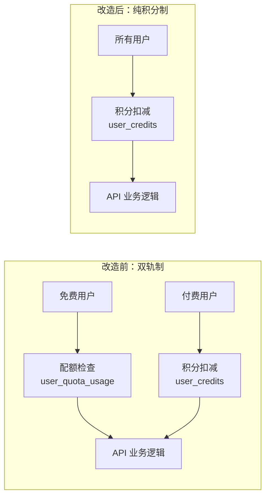
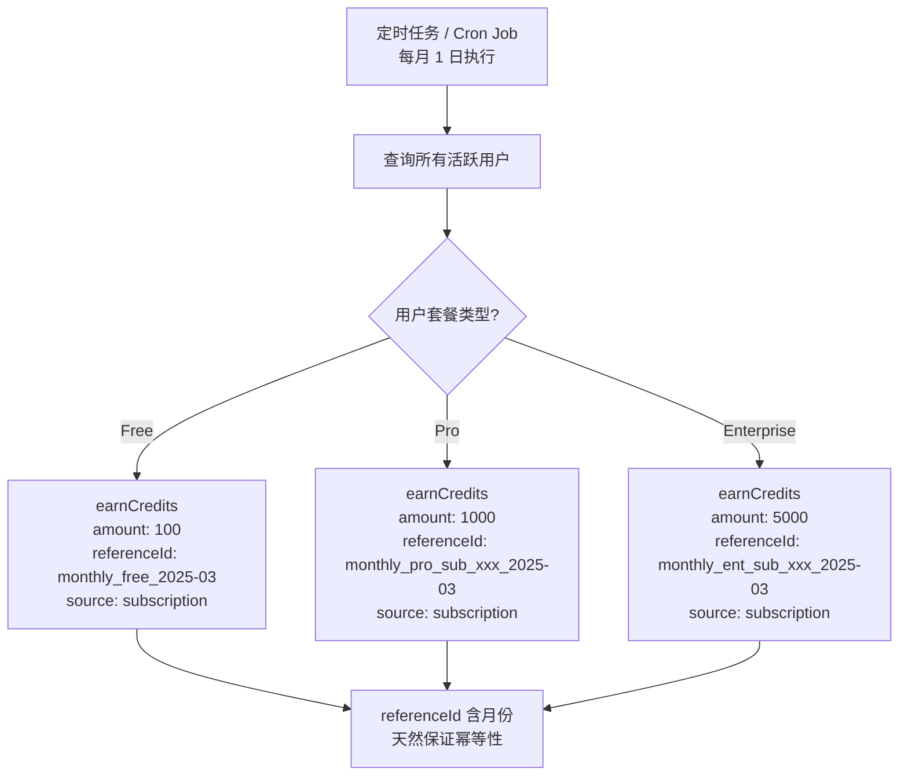
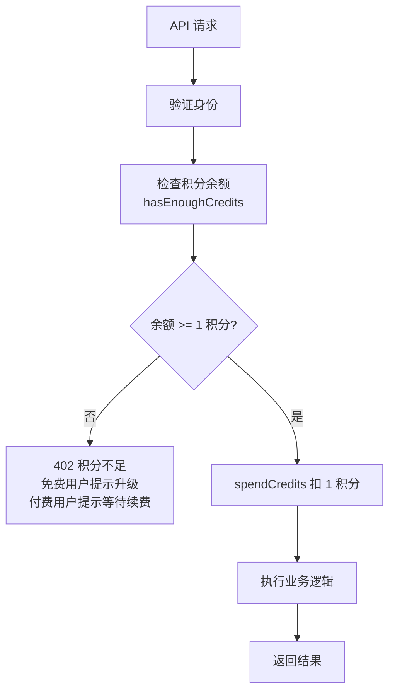
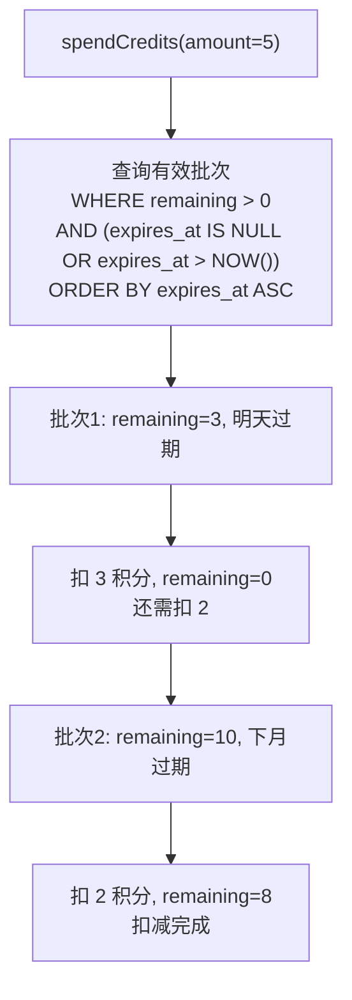
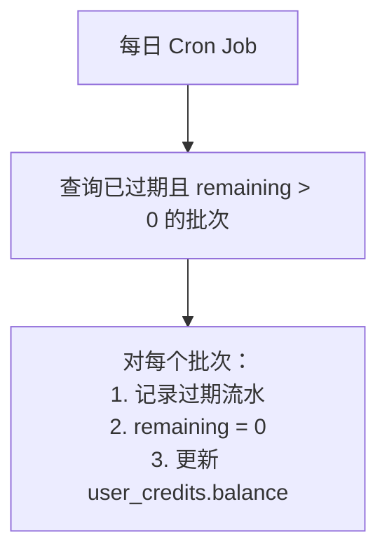
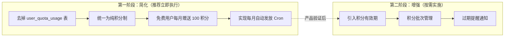

# 简化方案评估：去掉配额系统，只保留积分 + 积分有效期机制

> 评估将当前"配额（Quota）+ 积分（Credits）"双轨制简化为"纯积分制"的可行性，以及引入积分有效期的利弊。

---

## 目录

1. [当前双轨制的问题](#1-当前双轨制的问题)
2. [纯积分制方案评估](#2-纯积分制方案评估)
3. [积分有效期机制评估](#3-积分有效期机制评估)
4. [推荐的最终方案](#4-推荐的最终方案)
5. [实施影响分析](#5-实施影响分析)

---

## 1. 当前双轨制的问题

### 1.1 当前架构

```
免费用户 → user_quota_usage 表（每月 100 次上限）
付费用户 → user_credits 表（积分扣减）+ user_quota_usage 表（统计展示）
```

### 1.2 问题总结

| 问题 | 说明 |
|------|------|
| **概念冗余** | 两套系统本质上都在做同一件事——控制用户资源使用量 |
| **代码复杂** | 每个 API 端点需同时处理"检查配额"和"扣减积分"两条逻辑 |
| **实际断裂** | 配额的写入函数（`trackApiCall`）在业务代码中未被调用，系统处于半实现状态 |
| **数值矛盾** | 免费用户注册送 50 积分，但配额设 100 次；Pro 配额 10,000 次但月积分仅 1,000——两套数值难以协调 |
| **维护成本** | 两张表、两套服务、两套配置，增加长期维护负担 |

---

## 2. 纯积分制方案评估

### 2.1 核心思路

**去掉 `user_quota_usage` 表和配额服务，所有资源消耗统一通过积分系统管理。免费用户的"每月免费额度"改为"每月赠送积分"。**

### 2.2 可行性判断：✅ 完全可行

理由如下：

| 维度 | 分析 |
|------|------|
| **功能覆盖** | 积分系统已具备 earn/spend/freeze/refund 全套能力，完全能替代配额的"计数+限制"功能 |
| **免费额度** | 通过每月定时赠送积分实现，效果等同于配额重置 |
| **统计需求** | `credit_transactions` 表已有完整流水，按月统计 `source='api_call'` 的 `spend` 记录即可替代配额表的统计功能 |
| **现有代码** | AI Chat API 已经只用积分，无需改造核心业务逻辑 |

### 2.3 改造前后对比



### 2.4 免费用户的"每月赠送积分"方案

| 配置项 | 当前值 | 建议值 | 说明 |
|--------|--------|--------|------|
| Free 注册赠送 | 50 | 100 | 等同原配额的月免费额度 |
| Free 每月赠送 | 50 | 100 | 替代原来的 100 次/月配额 |
| Pro 每月赠送 | 1,000 | 1,000 | 不变 |
| Enterprise 每月赠送 | 5,000 | 5,000 | 不变 |

> 注：当前 `payment.config.ts` 中 Free 套餐已配置了 `credits.monthly: 50`，只需调整数值并实现每月自动发放逻辑即可。

### 2.5 每月积分发放的实现方式



**关键设计**：`referenceId` 包含 `YYYY-MM` 月份标识，数据库唯一约束自动防止同月重复发放。

### 2.6 统一后的 API 调用流程



所有用户走同一条路径，代码大幅简化。

---

## 3. 积分有效期机制评估

### 3.1 核心思路

给积分添加有效期，过期积分自动失效。典型场景：每月赠送的免费积分月底过期，不可累积。

### 3.2 可行性判断：✅ 可行，但需权衡复杂度

### 3.3 有效期带来的好处

| 好处 | 说明 |
|------|------|
| **防止积分囤积** | 免费用户不会通过长期不用积累大量积分后一次性消耗 |
| **控制成本** | 过期积分等于"收回"了未使用的资源承诺，降低服务商潜在成本 |
| **激励使用** | 用户知道积分会过期，更倾向于及时使用，提高产品活跃度 |
| **灵活促销** | 可以发放"限时积分"用于营销活动（如 7 天内有效的体验积分） |
| **差异化策略** | 免费赠送积分设短有效期，付费积分设长有效期或永久，形成付费动力 |

### 3.4 有效期引入的复杂度

| 挑战 | 说明 | 难度 |
|------|------|------|
| **数据模型改造** | 需要在 `credit_transactions` 或新表中记录每笔积分的过期时间 | ⚠️ 中 |
| **扣减顺序** | 消费时需"先过期先扣"（FEFO），而非从总余额扣减 | ⚠️ 中 |
| **过期清算** | 需要定时任务扫描并标记过期积分，更新余额 | ⚠️ 中 |
| **余额计算** | `balance` 不再是简单的加减，需排除已过期部分 | ⚠️ 中 |
| **用户体验** | 需要在前端展示"即将过期"的积分，增加 UI 复杂度 | ⚡ 低 |
| **退款处理** | 退款时需判断原积分是否已过期 | ⚠️ 中 |

### 3.5 有效期的实现方案

#### 方案 A：积分批次表（推荐）

新增一张 `credit_batches` 表，记录每笔积分的获取时间和过期时间：

```sql
CREATE TABLE credit_batches (
    id          TEXT PRIMARY KEY,
    user_id     TEXT NOT NULL REFERENCES "user"(id),
    amount      INTEGER NOT NULL,       -- 该批次原始积分数
    remaining   INTEGER NOT NULL,       -- 该批次剩余可用积分
    source      TEXT NOT NULL,           -- 来源
    expires_at  TIMESTAMP,              -- 过期时间（NULL 表示永不过期）
    created_at  TIMESTAMP NOT NULL
);
```

**扣减逻辑**：按 `expires_at` 升序排列，优先消耗最早过期的批次（FEFO）：



**过期清算**：定时任务每日执行：



#### 方案 B：简化版——仅对免费赠送积分设有效期

如果觉得方案 A 复杂度太高，可以采用简化版：

- **付费积分**：永不过期（通过订阅获得的积分）
- **免费赠送积分**：当月有效（月底过期）
- **实现方式**：每月赠送积分时用新的 `referenceId`，月底 Cron 将上月未用完的赠送积分清零

这种方式不需要批次表，只需在每月赠送时：
1. 先过期上月的赠送积分（减去未用部分）
2. 再发放本月的赠送积分

### 3.6 是否推荐现在就加有效期？

| 阶段 | 建议 |
|------|------|
| **MVP / 早期** | ❌ 暂不加。先完成纯积分制简化，验证商业模型 |
| **产品成熟期** | ✅ 按需加入。当出现积分囤积问题或需要营销活动时再实施 |
| **企业版定制** | ✅ 可作为高级功能。不同客户可配置不同的过期策略 |

---

## 4. 推荐的最终方案

### 4.1 分阶段实施



### 4.2 第一阶段改造清单

| 步骤 | 改动内容 |
|------|---------|
| 1 | 调整 `payment.config.ts`：Free 套餐 `credits.monthly` 改为 100 |
| 2 | 实现月度积分发放 Cron Job（Vercel Cron / 外部调度器），使用 `referenceId: monthly_{planId}_{userId}_{YYYY-MM}` 保证幂等 |
| 3 | 简化 AI Chat API：移除配额检查分支，所有用户统一走 `spendCredits` |
| 4 | 简化 `getQuotaUsage`：改为从 `credit_transactions` 聚合统计，移除对 `user_quota_usage` 表的依赖 |
| 5 | 前端仪表盘：展示积分余额和本月消耗量（从 `credit_transactions` 聚合） |
| 6 | 移除 `quota-service.ts` 和 `user_quota_usage` 相关代码 |
| 7 | 生成数据库迁移：删除 `user_quota_usage` 表 |

### 4.3 需要保留的能力

即使去掉配额表，以下能力仍需通过积分系统保留：

| 能力 | 实现方式 |
|------|---------|
| 按月统计 API 调用次数 | `SELECT SUM(amount) FROM credit_transactions WHERE source='api_call' AND type='spend' AND created_at >= 月初` |
| 按月统计存储用量 | 同上，`source='storage'` |
| 用量仪表盘展示 | 基于上述聚合查询 |
| 月度重置免费额度 | 通过每月 `earnCredits` 自动发放 |

---

## 5. 实施影响分析

### 5.1 需要修改的文件

| 文件 | 改动类型 |
|------|---------|
| `src/server/db/schema.ts` | 删除 `userQuotaUsage` 表定义 |
| `src/lib/quota/quota-service.ts` | 整个文件删除 |
| `src/server/actions/credit-actions.ts` | 移除 `updateUserQuotaUsage`、`initializeUserQuotaUsage`、简化 `getQuotaUsage` |
| `src/config/credits.config.ts` | 移除 `freeUser` 配额配置，简化为纯积分消耗规则 |
| `src/config/payment.config.ts` | 调整 Free 套餐 `credits.monthly` 为 100 |
| `src/app/api/v1/ai/chat/route.ts` | 无需改动（已经是纯积分模式） |
| `src/app/api/credits/initialize/route.ts` | 移除 `quotaService.initializeForUser` 调用 |
| 新增：月度积分发放 Cron | 新建 API 路由或脚本 |

### 5.2 数据迁移

- `user_quota_usage` 表中的历史数据可归档后删除
- 现有 `user_credits` 和 `credit_transactions` 表结构无需改动
- 如果未来加积分有效期，需新增 `credit_batches` 表

### 5.3 风险评估

| 风险 | 等级 | 应对 |
|------|------|------|
| 免费用户积分累积 | 低 | 短期无碍；长期可通过有效期机制解决 |
| 月度发放遗漏 | 中 | Cron Job 需设监控告警；`referenceId` 幂等设计允许安全重试 |
| 统计性能 | 低 | `credit_transactions` 表加索引 `(userId, source, createdAt)` 即可 |

---

## 结论

**你的想法完全可行，而且是更优的设计。**

- ✅ **去掉配额、只保留积分**：大幅降低系统复杂度，当前代码实际上已经在这样做了（AI Chat API 只用积分），配额系统处于半废弃状态
- ✅ **免费用户每月赠送积分**：比配额更直观、更统一，用户只需要理解"积分"一个概念
- ✅ **积分有效期**：确实更灵活，但建议作为第二阶段实施，避免一次性引入过多复杂度

一句话总结：**先做减法（去配额），再按需做加法（加有效期）。**
