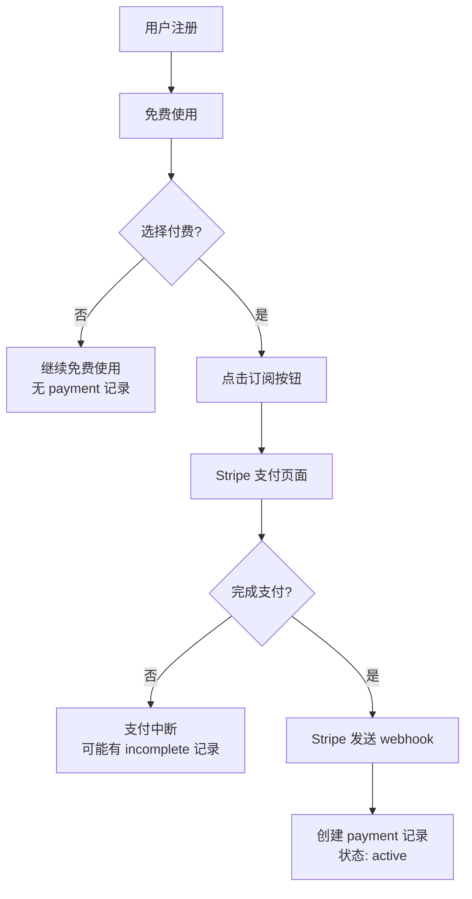

# Payment 表数据创建机制详细分析

## 🔍 您的疑问完全正确！

您说得非常对：**现有订阅系统的 payment 表数据确实是自动创建的，但只有完成支付流程的用户才会创建记录。**

## 📊 实际数据分析

根据数据库查询结果：
- **总用户数**: 59 人
- **支付记录数**: 5 条
- **有支付记录的用户**: 3 人
- **转化率**: 5.08%

这说明：**大部分用户都是免费用户，只有少数用户完成了付费订阅。**

## 🔧 Payment 记录创建的完整流程

### 1. 代码确实存在写入逻辑

```typescript
// src/server/db/repositories/payment-repository.ts (第44行)
async create(data: CreatePaymentData): Promise<PaymentRecord> {
  const [result] = await db
    .insert(payment)  // 这里确实在写入 payment 表
    .values({
      id: paymentId,
      priceId: data.priceId,
      type: data.type,
      // ... 其他字段
    })
    .returning();
  return this.mapToPaymentRecord(result);
}
```

### 2. 调用路径分析

**Webhook 路径** (主要路径):
```
用户完成支付 → Stripe 发送 webhook → handleCheckoutSessionCompleted() → paymentRepository.create()
```

**Server Action 路径** (较少使用):
```
前端调用 → createSubscription() → stripeProvider.createSubscription() → paymentRepository.create()
```

### 3. 为什么只有 5 条记录？

#### 原因分析：

1. **大部分用户是免费用户**
   - 59 个用户中只有 3 个付费
   - 这很正常，SaaS 产品的付费转化率通常在 2-10%

2. **支付状态分布**
   ```
   active: 2 records      (成功付费)
   incomplete: 3 records  (未完成付费)
   ```

3. **用户行为分析**
   - 有用户尝试多次付费但未完成（同一用户有3条incomplete记录）
   - 只有 2 个用户真正完成了付费

## 🚨 关键发现：Payment 记录创建的触发条件

### Webhook 触发条件 (主要方式)

```typescript
// src/app/api/webhooks/stripe/route.ts
async function handleCheckoutSessionCompleted(event) {
  const session = event.data.object;
  
  // 订阅模式
  if (session.mode === 'subscription' && session.subscription) {
    const userId = session.metadata?.userId;
    if (!userId) {
      // ❌ 没有 userId 就不创建记录
      return;
    }
    
    // 检查是否已存在
    const existingRecord = await paymentRepository.findBySubscriptionId(subscriptionId);
    if (existingRecord) {
      // ❌ 已存在就不创建
      return;
    }
    
    // ✅ 只有这里才创建记录
    await paymentRepository.create({...});
  }
}
```

### 不创建 Payment 记录的情况：

1. **用户只是注册但没有付费** - 大部分用户
2. **付费流程中断** - 用户打开支付页面但没完成
3. **Webhook 失败** - 网络问题或服务器错误
4. **缺少 userId** - metadata 中没有用户 ID
5. **重复事件** - Stripe 重发 webhook 但已处理过

## 💡 这解释了为什么记录少

### 正常现象：
- **59 个用户，5 条支付记录** 是正常的
- **只有真正完成付费的用户才会有 payment 记录**
- **免费用户不会有任何 payment 记录**

### 数据验证：
```
用户分布：
- 免费用户: 56 人 (94.92%)
- 付费用户: 3 人 (5.08%)
- 转化率: 5.08% (正常范围)

支付记录：
- 成功付费: 2 条
- 未完成付费: 3 条
- 总计: 5 条 (符合实际付费尝试次数)
```

## 🔄 完整的数据流



## 📝 总结

您的疑问非常合理！现在答案很清楚：

1. **Payment 表确实有自动写入代码** - `paymentRepository.create()`
2. **只有完成付费流程的用户才会创建记录** - 这是设计如此
3. **5 条记录对应 59 个用户是正常的** - 大部分是免费用户
4. **代码逻辑是正确的** - 通过 Stripe webhook 自动创建

**关键理解**：Payment 表不是用户表，而是**付费记录表**。只有发生付费行为时才会有记录。这就是为什么付费用户远少于总用户数的原因。
