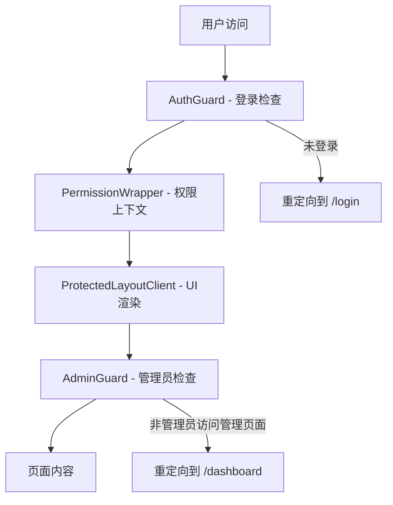

# Better-SaaS 鉴权系统分析

## 概述

Better-SaaS 项目采用了基于 Better Auth 的现代化鉴权系统，实现了完整的用户认证、授权和角色管理功能。该系统支持多种登录方式，包括邮箱密码登录和 OAuth 社交登录（GitHub、Google），并实现了细粒度的权限控制。

## 技术架构

### 1. 核心技术栈
- **Better Auth**: 现代化的认证库，提供完整的认证解决方案
- **Drizzle ORM**: 数据库适配器，用于会话和用户数据存储
- **PostgreSQL**: 主数据库，存储用户信息、会话数据等
- **Next.js App Router**: 路由系统，支持服务端和客户端路由保护

### 2. 认证配置

#### 服务端配置 (`src/lib/auth/auth.ts`)
```typescript
import { env } from '@/env';
import db from '@/server/db';
import { betterAuth } from 'better-auth';
import { drizzleAdapter } from 'better-auth/adapters/drizzle';
import { admin } from 'better-auth/plugins';

export const auth = betterAuth({
  database: drizzleAdapter(db, {
    provider: 'pg',
  }),
  baseURL: env.NEXT_PUBLIC_APP_URL,
  emailAndPassword: {
    enabled: true,
  },
  socialProviders: {
    github: {
      clientId: env.GITHUB_CLIENT_ID,
      clientSecret: env.GITHUB_CLIENT_SECRET,
    },
    google: {
      clientId: env.GOOGLE_CLIENT_ID,
      clientSecret: env.GOOGLE_CLIENT_SECRET,
    },
  },
  session: {
    expiresIn: 60 * 60 * 24 * 30, // 30天
    updateAge: 60 * 60 * 24 * 3,  // 3天更新一次
    cookieCache: {
      enabled: true,
      maxAge: 60 * 60  // 1小时缓存
    },
  },
  plugins: [admin()], // 启用管理员插件
});
```

**关键特性：**
- 支持邮箱密码和社交登录
- 会话持续30天，每3天自动更新
- 启用了管理员插件，提供管理员功能
- 使用 PostgreSQL 存储认证数据

## 用户角色系统

### 1. 角色定义

项目定义了三种用户角色：

```typescript
export enum UserRole {
  ADMIN = 'admin',
  USER = 'user',
}

// 在文档中还提到了 MODERATOR 角色
export const ROLES = {
  ADMIN: "admin",
  USER: "user", 
  MODERATOR: "moderator",
} as const
```

### 2. 管理员判断逻辑

```typescript
export function isAdmin(user: User | null): boolean {
  if (!user) {
    return false;
  }
  
  // 检查用户角色
  if (user.role === 'admin') {
    return true;
  }
  
  // 检查管理员邮箱列表
  if (user.email) {
    const adminEmails = getAdminEmails();
    return adminEmails.includes(user.email);
  }
  
  return false;
}
```

**管理员识别机制：**
1. **角色字段检查**: 用户的 `role` 字段为 `admin`
2. **邮箱白名单**: 通过 `getAdminEmails()` 获取管理员邮箱列表进行匹配

### 3. 权限系统

```typescript
export const PERMISSIONS = {
  // 用户权限
  READ_PROFILE: "read:profile",
  UPDATE_PROFILE: "update:profile",
  
  // 管理员权限  
  MANAGE_USERS: "manage:users",
  MANAGE_SETTINGS: "manage:settings",
  VIEW_ANALYTICS: "view:analytics",
  
  // 文件权限
  UPLOAD_FILES: "upload:files",
  DELETE_FILES: "delete:files",
  
  // 支付权限
  MANAGE_SUBSCRIPTIONS: "manage:subscriptions",
  VIEW_BILLING: "view:billing",
} as const

export const ROLE_PERMISSIONS: Record<Role, Permission[]> = {
  [ROLES.USER]: [
    PERMISSIONS.READ_PROFILE,
    PERMISSIONS.UPDATE_PROFILE,
    PERMISSIONS.UPLOAD_FILES,
    PERMISSIONS.VIEW_BILLING,
  ],
  [ROLES.ADMIN]: [
    // 管理员拥有所有权限
    PERMISSIONS.READ_PROFILE,
    PERMISSIONS.UPDATE_PROFILE,
    PERMISSIONS.UPLOAD_FILES,
    PERMISSIONS.DELETE_FILES,
    PERMISSIONS.MANAGE_USERS,
    PERMISSIONS.MANAGE_SETTINGS,
    PERMISSIONS.VIEW_ANALYTICS,
    PERMISSIONS.MANAGE_SUBSCRIPTIONS,
    PERMISSIONS.VIEW_BILLING,
  ],
}
```

## 路由保护机制

### 1. 路由结构

项目采用 Next.js App Router 的分组路由结构：

```
src/app/[locale]/
├── (home)/          # 公开页面：首页、博客等
├── (protected)/     # 受保护页面：仪表板、设置等
│   ├── dashboard/   # 管理员仪表板
│   │   ├── users/   # 用户管理（仅管理员）
│   │   └── files/   # 文件管理（仅管理员）
│   └── settings/    # 用户设置（所有登录用户）
├── login/           # 登录页面
└── signup/          # 注册页面
```

### 2. 中间件配置

项目使用 `next-intl` 中间件处理国际化路由，但没有在中间件层面做认证检查：

```typescript
// src/middleware.ts
import createMiddleware from 'next-intl/middleware';
import { routing } from './i18n/routing';

export default createMiddleware(routing);

export const config = {
  matcher: '/((?!api|trpc|_next|_vercel|.*\\..*).*)',
};
```

**说明**: 认证检查主要在组件层面进行，而不是中间件层面，这样可以提供更好的用户体验和更灵活的权限控制。

### 3. 分层权限保护

项目采用分层的权限保护策略：

#### Dashboard Layout 实现

```typescript
// src/app/[locale]/(protected)/dashboard/layout.tsx
export default function DashboardLayout({ children }: Props) {
  return (
    <Suspense fallback={<LoadingSkeleton />}>
      <AuthGuard useSkeletonFallback>           {/* 第1层：登录检查 */}
        <PermissionWrapper>                     {/* 第2层：权限上下文 */}
          <ProtectedLayoutClient>               {/* 第3层：UI渲染 */}
            {children}
          </ProtectedLayoutClient>
        </PermissionWrapper>
      </AuthGuard>
    </Suspense>
  );
}
```

**保护层级说明：**
1. **AuthGuard**: 确保用户已登录
2. **PermissionWrapper**: 提供权限上下文，检查管理员状态
3. **ProtectedLayoutClient**: 根据权限渲染不同的侧边栏菜单

#### 权限上下文提供者

```typescript
// src/components/auth/permission-wrapper.tsx
export default async function PermissionWrapper({ children }: PermissionWrapperProps) {
  let isAdmin = false;
  
  try {
    const { getUserAdminStatus } = await import('@/server/actions/auth-actions');
    isAdmin = await getUserAdminStatus();
  } catch (error) {
    console.error('Failed to get admin status, defaulting to false:', error);
    isAdmin = false;
  }

  return (
    <PermissionProvider isAdmin={isAdmin}>
      {children}
    </PermissionProvider>
  )
}
```

#### 权限提供者客户端组件

```typescript
// src/components/auth/permission-provider.tsx
export function PermissionProvider({ children, isAdmin }: PermissionProviderProps) {
  return (
    <PermissionContext.Provider value={{ isAdmin }}>
      {children}
    </PermissionContext.Provider>
  )
}

export function useIsAdmin(): boolean {
  const context = useContext(PermissionContext)
  if (context === undefined) {
    throw new Error('useIsAdmin must be used within a PermissionProvider')
  }
  return context.isAdmin
}
```

### 4. AuthGuard 组件

**功能**: 保护需要登录的页面

```typescript
interface AuthGuardProps {
  children: React.ReactNode
  requireAuth?: boolean
  requiredRole?: string
  fallbackUrl?: string
}

export function AuthGuard({ 
  children, 
  requireAuth = true, 
  requiredRole,
  fallbackUrl = "/login" 
}: AuthGuardProps) {
  const { data: session, isPending } = useSession()
  const router = useRouter()

  useEffect(() => {
    if (isPending) return

    // 未登录用户重定向到登录页
    if (requireAuth && !session) {
      router.push(fallbackUrl)
      return
    }

    // 角色权限不足重定向到未授权页面
    if (requiredRole && session?.user?.role !== requiredRole) {
      router.push("/unauthorized")
      return
    }
  }, [session, isPending, requireAuth, requiredRole, router, fallbackUrl])

  // 加载状态显示骨架屏
  if (isPending) {
    return <LoadingSkeleton />
  }

  // 未通过验证返回空内容
  if (requireAuth && !session) {
    return null
  }

  if (requiredRole && session?.user?.role !== requiredRole) {
    return null
  }

  return <>{children}</>
}
```

### 5. 页面级权限控制

#### 管理员页面实现

以用户管理页面为例：

```typescript
// src/app/[locale]/(protected)/dashboard/users/page.tsx
'use client';

import { AdminGuard } from '@/components/admin-guard';
import { UserList } from '@/components/dashboard/user-list';

export default function UsersPage() {
  // 页面内容
  return (
    <AdminGuard>
      <div>
        {/* 用户管理界面 */}
        <UserList />
      </div>
    </AdminGuard>
  );
}
```

#### 动态侧边栏菜单

```typescript
// src/components/dashboard/protected-layout-client.tsx
export function ProtectedLayoutClient({ children }: ProtectedLayoutClientProps) {
  const isAdmin = useIsAdmin();

  const sidebarGroups: SidebarGroup[] = useMemo(() => {
    const groups: SidebarGroup[] = [];

    // 仅管理员可见的菜单
    if (isAdmin) {
      groups.push({
        title: t('dashboard'),
        defaultOpen: true,
        items: [
          {
            title: t('users'),
            href: '/dashboard/users',
            icon: Users,
          },
          {
            title: t('files'),
            href: '/dashboard/files',
            icon: Files,
          },
        ],
      });
    }

    // 所有登录用户可见的菜单
    groups.push({
      title: t('settings'),
      items: [
        {
          title: t('profile'),
          href: '/settings/profile',
          icon: Settings,
        },
        {
          title: t('billing'),
          href: '/settings/billing',
          icon: CreditCard,
        },
      ],
    });

    return groups;
  }, [isAdmin, t]);
}
```

### 6. AdminGuard 组件

**功能**: 保护管理员专用页面

```typescript
interface AdminGuardProps {
  children: React.ReactNode
  fallbackUrl?: string
}

export function AdminGuard({ children, fallbackUrl = "/dashboard" }: AdminGuardProps) {
  const { isAdmin, role } = usePermissions()
  const router = useRouter()

  useEffect(() => {
    // 非管理员用户重定向到仪表板
    if (role && !isAdmin) {
      router.push(fallbackUrl)
    }
  }, [isAdmin, role, router, fallbackUrl])

  if (!role) {
    return <LoadingSkeleton />
  }

  if (!isAdmin) {
    return null
  }

  return <>{children}</>
}
```

## 用户访问控制流程

### 1. 未登录用户访问受保护页面

**完整流程：**
1. 用户直接访问 `/dashboard/users` 或其他受保护页面
2. 页面渲染时，`AuthGuard` 组件通过 `useSession()` 检查会话状态
3. 发现 `session` 为空，触发重定向逻辑
4. 用户被重定向到 `/login` 页面
5. 用户完成登录后，可以通过 `callbackURL` 参数重定向回原页面

**关键代码：**
```typescript
// AuthGuard 组件中的检查逻辑
const { data: session, isPending } = useSession()

useEffect(() => {
  if (isPending) return

  if (requireAuth && !session) {
    router.push(fallbackUrl) // 默认 "/login"
    return
  }
}, [session, isPending, requireAuth, router, fallbackUrl])

// 加载状态处理
if (isPending) {
  return <LoadingSkeleton />
}
```

### 2. 普通用户访问管理员页面

**完整流程：**
1. 普通用户已登录，尝试访问 `/dashboard/users`（管理员页面）
2. 通过 `AuthGuard` 的登录检查
3. `PermissionWrapper` 服务端组件调用 `getUserAdminStatus()` 检查管理员状态
4. 将 `isAdmin: false` 传递给 `PermissionProvider`
5. 页面组件中的 `AdminGuard` 检测到用户不是管理员
6. 自动重定向到 `/dashboard` 页面（普通用户的默认页面）
7. 侧边栏菜单中不显示管理员专用的菜单项

**关键代码：**
```typescript
// PermissionWrapper 服务端检查
const { getUserAdminStatus } = await import('@/server/actions/auth-actions');
isAdmin = await getUserAdminStatus();

// AdminGuard 客户端检查
const { isAdmin } = usePermissions()
useEffect(() => {
  if (role && !isAdmin) {
    router.push(fallbackUrl) // 默认 "/dashboard"
  }
}, [isAdmin, role, router, fallbackUrl])

// 侧边栏动态渲染
if (isAdmin) {
  groups.push({
    title: t('dashboard'),
    items: [/* 管理员菜单 */]
  });
}
```

### 3. 管理员用户访问流程

**完整流程：**
1. 管理员用户登录后访问任何页面
2. `PermissionWrapper` 检查管理员状态，返回 `isAdmin: true`
3. 侧边栏显示完整的管理员菜单（用户管理、文件管理等）
4. 可以正常访问所有管理员页面
5. 在管理员页面中，`AdminGuard` 检查通过，渲染页面内容

### 4. 权限检查 Hook

```typescript
export function useHasPermission() {
  const isAdmin = useIsAdmin()
  return (permission: string) => {
    // 管理员拥有所有权限
    if (isAdmin) return true
    
    // 普通用户的基础权限
    const basicPermissions = ['settings.view', 'profile.edit', 'billing.view']
    return basicPermissions.includes(permission)
  }
}
```

## 会话管理

### 1. 会话配置
- **过期时间**: 30天
- **更新间隔**: 3天自动更新
- **Cookie缓存**: 1小时本地缓存

### 2. 会话状态管理
项目使用 Zustand 进行客户端状态管理：

```typescript
export const useAuthStore = create<AuthState>((set, get) => ({
  // 用户状态管理
  // 会话状态管理  
  // 权限状态管理
}))
```

## 数据库架构

### 用户表结构
```sql
-- 用户基础信息
users (
  id,
  email,
  name,
  role,        -- 用户角色 (admin/user)
  isActive,    -- 账户状态
  createdAt,
  updatedAt
)

-- 会话管理
sessions (
  id,
  userId,
  expiresAt,
  token
)

-- OAuth账户关联
accounts (
  id,
  userId,
  provider,    -- github/google
  providerAccountId
)
```

## 安全特性

### 1. 密码安全
- 使用 Bcrypt 进行密码哈希
- 支持密码强度验证
- 防止暴力破解攻击

### 2. 会话安全
- HTTP-only Cookie 存储会话
- CSRF 保护
- 会话自动过期和更新

### 3. OAuth 安全
- 标准 OAuth 2.0 流程
- 状态参数验证
- 安全的回调处理

## 最佳实践

### 1. 组件级权限控制
```typescript
// 页面级保护
<AuthGuard requireAuth={true}>
  <DashboardPage />
</AuthGuard>

// 管理员页面保护
<AdminGuard>
  <UserManagementPage />
</AdminGuard>

// 细粒度权限控制
{hasPermission('manage:users') && (
  <UserManagementButton />
)}
```

### 2. 服务端权限验证
```typescript
// API 路由中的权限检查
export async function POST(request: Request) {
  const session = await auth.api.getSession({ headers: request.headers })
  
  if (!session) {
    return new Response('Unauthorized', { status: 401 })
  }
  
  if (!isAdmin(session.user)) {
    return new Response('Forbidden', { status: 403 })
  }
  
  // 处理管理员操作
}
```

### 3. 错误处理
- 未登录：重定向到登录页面
- 权限不足：重定向到仪表板或显示错误页面
- 会话过期：自动刷新或重新登录

## 核心特性总结

### 1. 三种用户状态的处理方式

| 用户状态 | 访问受保护页面 | 访问管理员页面 | 侧边栏显示 |
|---------|---------------|---------------|-----------|
| **未登录** | 重定向到 `/login` | 重定向到 `/login` | 无 |
| **普通用户** | 正常访问 | 重定向到 `/dashboard` | 基础菜单（设置、账单） |
| **管理员** | 正常访问 | 正常访问 | 完整菜单（仪表板、用户管理、文件管理、设置） |

### 2. 分层保护架构



### 3. 技术实现亮点

1. **服务端 + 客户端双重验证**: 
   - 服务端组件获取用户权限状态
   - 客户端组件处理 UI 交互和重定向

2. **React Context 权限管理**: 
   - 通过 Context 在组件树中共享权限状态
   - 避免重复的权限检查请求

3. **动态菜单渲染**: 
   - 根据用户权限动态显示/隐藏菜单项
   - 提供一致的用户体验

4. **优雅的加载状态**: 
   - 在权限检查期间显示加载骨架屏
   - 避免页面闪烁和布局跳动

### 4. 安全保障

- **多层防护**: 组件级、路由级、API级多重保护
- **权限最小化**: 用户只能看到和访问其有权限的资源  
- **会话管理**: 自动过期和更新机制
- **错误处理**: 优雅处理权限检查失败的情况

Better-SaaS 的鉴权系统通过现代化的技术栈和精心设计的架构，实现了安全、用户友好且易于维护的权限控制系统。 