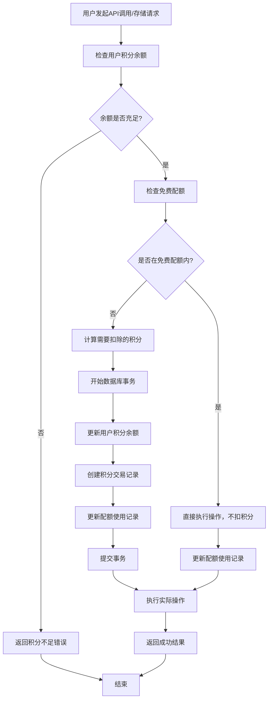

# 积分消耗和扣除流程技术文档

## 概述

本文档详细说明了 Better SaaS 项目中积分系统的消耗方式和扣除流程，包括系统架构、数据流程、关键代码实现和流程图。

## 系统架构

### 核心组件

1. **积分服务层** (`src/lib/credits/credit-service.ts`)
2. **配额服务层** (`src/lib/quota/quota-service.ts`)
3. **积分配置** (`src/config/credits.config.ts`)
4. **数据库层** (`src/server/db/schema.ts`)
5. **支付集成** (`src/payment/stripe/`)

### 数据库结构

#### 用户积分表 (user_credits)
```sql
CREATE TABLE user_credits (
  id TEXT PRIMARY KEY,
  user_id TEXT NOT NULL REFERENCES users(id) ON DELETE CASCADE,
  balance INTEGER NOT NULL DEFAULT 0,           -- 当前可用余额
  total_earned INTEGER NOT NULL DEFAULT 0,      -- 总赚取积分
  total_spent INTEGER NOT NULL DEFAULT 0,       -- 总花费积分
  frozen_balance INTEGER NOT NULL DEFAULT 0,    -- 冻结积分
  created_at TIMESTAMP NOT NULL DEFAULT NOW(),
  updated_at TIMESTAMP NOT NULL DEFAULT NOW()
);
```

#### 积分交易表 (credit_transactions)
```sql
CREATE TABLE credit_transactions (
  id TEXT PRIMARY KEY,
  user_id TEXT NOT NULL REFERENCES users(id) ON DELETE CASCADE,
  type TEXT NOT NULL CHECK (type IN ('earn', 'spend', 'refund', 'admin_adjust', 'freeze', 'unfreeze')),
  amount INTEGER NOT NULL,                      -- 交易金额
  balance_after INTEGER NOT NULL,               -- 交易后余额
  source TEXT NOT NULL CHECK (source IN ('subscription', 'api_call', 'admin', 'storage', 'bonus')),
  description TEXT,                             -- 交易描述
  reference_id TEXT,                            -- 关联ID（用于幂等性）
  metadata TEXT,                                -- JSON格式的元数据
  created_at TIMESTAMP NOT NULL DEFAULT NOW()
);
```

#### 配额使用表 (user_quota_usage)
```sql
CREATE TABLE user_quota_usage (
  id TEXT PRIMARY KEY,
  user_id TEXT NOT NULL REFERENCES users(id) ON DELETE CASCADE,
  service TEXT NOT NULL CHECK (service IN ('api_call', 'storage', 'custom')),
  period TEXT NOT NULL,                         -- 格式: YYYY-MM
  used_amount INTEGER NOT NULL DEFAULT 0,       -- 已使用量
  created_at TIMESTAMP NOT NULL DEFAULT NOW(),
  updated_at TIMESTAMP NOT NULL DEFAULT NOW()
);
```

## 积分配置系统

### 积分消耗规则配置

```typescript
// src/config/credits.config.ts
export const creditsConfig = {
  enabled: true,
  currency: 'credits',
  
  // API调用成本
  apiCosts: {
    costPerCall: 1,                    // 每次API调用消耗1积分
    freeQuotaForPaidUsers: 1000,       // 付费用户免费配额
  },
  
  // 存储成本
  storageCosts: {
    costPerGB: 100,                    // 每GB存储消耗100积分
    freeQuotaForPaidUsers: 10,         // 付费用户免费10GB
  },
  
  // 免费用户配额
  freeUserQuotas: {
    apiCalls: 100,                     // 免费100次API调用
    storage: 1,                        // 免费1GB存储
  },
};
```

### 订阅计划积分配置

```typescript
// src/config/payment.config.ts
export const paymentConfig = {
  plans: [
    {
      id: 'free',
      name: 'Free',
      credits: {
        monthly: 50,      // 每月免费积分
        onSignup: 50,     // 注册赠送积分
      },
    },
    {
      id: 'pro',
      name: 'Pro',
      credits: {
        monthly: 1000,    // 每月1000积分
        onSubscribe: 1000, // 订阅时立即获得1000积分
      },
    },
  ],
};
```

## 积分扣除流程

### 流程图



### 核心扣除逻辑

#### 1. 积分扣除服务 (CreditService.spendCredits)

```typescript
// src/lib/credits/credit-service.ts
export class CreditService {
  /**
   * 扣除用户积分
   * @param params 扣除参数
   * @returns 扣除后的积分账户信息
   */
  async spendCredits(params: {
    userId: string;
    amount: number;
    source: CreditSource;
    description?: string;
    referenceId?: string;
    metadata?: Record<string, any>;
  }): Promise<UserCreditAccount> {
    const { userId, amount, source, description, referenceId, metadata } = params;

    // 1. 验证参数
    if (amount <= 0) {
      throw new Error('Amount must be positive');
    }

    return await db.transaction(async (tx) => {
      // 2. 获取当前积分账户（加锁）
      const account = await tx
        .select()
        .from(userCredit)
        .where(eq(userCredit.userId, userId))
        .for('update')
        .then(rows => rows[0]);

      if (!account) {
        throw new Error('Credit account not found');
      }

      // 3. 检查余额是否充足
      const availableBalance = account.balance - account.frozenBalance;
      if (availableBalance < amount) {
        throw new Error(`Insufficient credits. Available: ${availableBalance}, Required: ${amount}`);
      }

      // 4. 更新积分账户
      const newBalance = account.balance - amount;
      const newTotalSpent = account.totalSpent + amount;
      
      await tx
        .update(userCredit)
        .set({
          balance: newBalance,
          totalSpent: newTotalSpent,
          updatedAt: new Date(),
        })
        .where(eq(userCredit.userId, userId));

      // 5. 创建交易记录
      const transactionId = generateId();
      await tx.insert(creditTransactions).values({
        id: transactionId,
        userId,
        type: 'spend',
        amount: -amount, // 负数表示支出
        balanceAfter: newBalance,
        source,
        description: description || `Spent ${amount} credits`,
        referenceId,
        metadata: metadata ? JSON.stringify(metadata) : null,
      });

      // 6. 返回更新后的账户信息
      return {
        id: account.id,
        userId,
        balance: newBalance,
        totalEarned: account.totalEarned,
        totalSpent: newTotalSpent,
        frozenBalance: account.frozenBalance,
        createdAt: account.createdAt,
        updatedAt: new Date(),
      };
    });
  }

  /**
   * 检查用户是否有足够积分
   */
  async hasEnoughCredits(userId: string, amount: number): Promise<boolean> {
    const account = await this.getCreditAccount(userId);
    if (!account) return false;
    
    const availableBalance = account.balance - account.frozenBalance;
    return availableBalance >= amount;
  }
}
```

#### 2. 配额服务集成

```typescript
// src/lib/quota/quota-service.ts

/**
 * 跟踪API调用并扣除积分
 */
export async function trackApiCall(
  userId: string,
  service: string = 'api_call',
  amount: number = 1
): Promise<void> {
  const period = getCurrentPeriod(); // 格式: YYYY-MM
  
  // 1. 检查用户订阅状态
  const userSubscription = await getUserSubscription(userId);
  const isPaidUser = userSubscription && userSubscription.status === 'active';
  
  // 2. 获取当前使用量
  const currentUsage = await getApiCallUsage(userId, period);
  
  // 3. 计算免费配额
  const freeQuota = isPaidUser 
    ? creditsConfig.apiCosts.freeQuotaForPaidUsers 
    : creditsConfig.freeUserQuotas.apiCalls;
  
  // 4. 判断是否需要扣除积分
  const newUsage = currentUsage + amount;
  const chargeableAmount = Math.max(0, newUsage - freeQuota);
  const previousChargeableAmount = Math.max(0, currentUsage - freeQuota);
  const creditsToCharge = (chargeableAmount - previousChargeableAmount) * creditsConfig.apiCosts.costPerCall;
  
  // 5. 扣除积分（如果需要）
  if (creditsToCharge > 0) {
    await creditService.spendCredits({
      userId,
      amount: creditsToCharge,
      source: 'api_call',
      description: `API call charges for ${amount} calls`,
      referenceId: `api_${userId}_${period}_${Date.now()}`,
      metadata: {
        service,
        callCount: amount,
        period,
        freeQuotaUsed: Math.min(newUsage, freeQuota),
      },
    });
  }
  
  // 6. 更新配额使用记录
  await updateQuotaUsage({
    userId,
    service: 'api_call',
    period,
    amount,
  });
}

/**
 * 跟踪存储使用并扣除积分
 */
export async function trackStorageUsage(
  userId: string,
  sizeInGB: number
): Promise<void> {
  const period = getCurrentPeriod();
  
  // 1. 检查用户订阅状态
  const userSubscription = await getUserSubscription(userId);
  const isPaidUser = userSubscription && userSubscription.status === 'active';
  
  // 2. 获取当前存储使用量
  const currentUsage = await getStorageUsage(userId, period);
  
  // 3. 计算免费配额
  const freeQuota = isPaidUser 
    ? creditsConfig.storageCosts.freeQuotaForPaidUsers 
    : creditsConfig.freeUserQuotas.storage;
  
  // 4. 计算需要扣除的积分
  const newUsage = currentUsage + sizeInGB;
  const chargeableAmount = Math.max(0, newUsage - freeQuota);
  const previousChargeableAmount = Math.max(0, currentUsage - freeQuota);
  const creditsToCharge = Math.ceil((chargeableAmount - previousChargeableAmount) * creditsConfig.storageCosts.costPerGB);
  
  // 5. 扣除积分（如果需要）
  if (creditsToCharge > 0) {
    await creditService.spendCredits({
      userId,
      amount: creditsToCharge,
      source: 'storage',
      description: `Storage charges for ${sizeInGB}GB`,
      referenceId: `storage_${userId}_${period}_${Date.now()}`,
      metadata: {
        sizeInGB,
        period,
        freeQuotaUsed: Math.min(newUsage, freeQuota),
      },
    });
  }
  
  // 6. 更新配额使用记录
  await updateQuotaUsage({
    userId,
    service: 'storage',
    period,
    amount: sizeInGB,
  });
}
```

## 积分获取流程

### 订阅积分发放

```typescript
// src/app/api/webhooks/stripe/route.ts

/**
 * 处理订阅创建，发放订阅积分
 */
async function grantSubscriptionCredits(
  userId: string, 
  priceId: string, 
  subscriptionId: string, 
  isYearly: boolean
) {
  const plan = findPlanByPriceId(priceId);
  if (!plan?.credits) return;

  // 计算要发放的积分
  const creditsToGrant = plan.credits.onSubscribe || 
    (isYearly ? plan.credits.yearly : plan.credits.monthly);

  if (creditsToGrant && creditsToGrant > 0) {
    await creditService.earnCredits({
      userId,
      amount: creditsToGrant,
      source: 'subscription',
      description: `${plan.name} subscription credits`,
      referenceId: `sub_${subscriptionId}`,
      metadata: {
        planId: plan.id,
        subscriptionId,
        isYearly,
      },
    });
  }
}

/**
 * 处理每月定期积分发放
 */
async function grantMonthlyCredits(
  userId: string, 
  priceId: string, 
  subscriptionId: string, 
  invoiceId: string
) {
  const plan = findPlanByPriceId(priceId);
  if (!plan?.credits?.monthly) return;

  await creditService.earnCredits({
    userId,
    amount: plan.credits.monthly,
    source: 'subscription',
    description: `Monthly ${plan.name} credits`,
    referenceId: `${subscriptionId}_${invoiceId}`,
    metadata: {
      planId: plan.id,
      subscriptionId,
      invoiceId,
      period: getCurrentPeriod(),
    },
  });
}
```

## 使用示例

### API端点中的积分扣除

```typescript
// 示例：AI API调用端点
export async function POST(request: Request) {
  try {
    const { userId } = await auth();
    if (!userId) {
      return NextResponse.json({ error: 'Unauthorized' }, { status: 401 });
    }

    // 1. 检查积分余额
    const hasCredits = await creditService.hasEnoughCredits(userId, 1);
    if (!hasCredits) {
      return NextResponse.json(
        { error: 'Insufficient credits' }, 
        { status: 402 }
      );
    }

    // 2. 跟踪API调用（自动扣除积分）
    await trackApiCall(userId, 'ai_api', 1);

    // 3. 执行实际的AI API调用
    const result = await callAIService(request);

    return NextResponse.json(result);
  } catch (error) {
    console.error('API call failed:', error);
    return NextResponse.json(
      { error: 'Internal server error' }, 
      { status: 500 }
    );
  }
}
```

### 文件上传中的积分扣除

```typescript
// 示例：文件上传端点
export async function POST(request: Request) {
  try {
    const { userId } = await auth();
    const formData = await request.formData();
    const file = formData.get('file') as File;
    
    const fileSizeGB = file.size / (1024 * 1024 * 1024);
    
    // 1. 预检查积分（估算成本）
    const estimatedCost = Math.ceil(fileSizeGB * creditsConfig.storageCosts.costPerGB);
    const hasCredits = await creditService.hasEnoughCredits(userId, estimatedCost);
    
    if (!hasCredits) {
      return NextResponse.json(
        { error: 'Insufficient credits for file upload' }, 
        { status: 402 }
      );
    }

    // 2. 上传文件
    const uploadResult = await uploadFile(file);

    // 3. 跟踪存储使用（自动扣除积分）
    await trackStorageUsage(userId, fileSizeGB);

    return NextResponse.json(uploadResult);
  } catch (error) {
    console.error('File upload failed:', error);
    return NextResponse.json(
      { error: 'Upload failed' }, 
      { status: 500 }
    );
  }
}
```

## 错误处理和边界情况

### 1. 积分不足处理

```typescript
try {
  await creditService.spendCredits({
    userId,
    amount: requiredCredits,
    source: 'api_call',
  });
} catch (error) {
  if (error.message.includes('Insufficient credits')) {
    // 返回特定的积分不足错误
    return NextResponse.json(
      { 
        error: 'INSUFFICIENT_CREDITS',
        message: 'Not enough credits to complete this operation',
        required: requiredCredits,
        available: await creditService.getAvailableBalance(userId)
      }, 
      { status: 402 }
    );
  }
  throw error;
}
```

### 2. 幂等性保证

```typescript
// 使用referenceId确保同一操作不会重复扣费
const referenceId = `api_${userId}_${operationId}`;

try {
  await creditService.spendCredits({
    userId,
    amount: cost,
    source: 'api_call',
    referenceId, // 防重复扣费
  });
} catch (error) {
  if (error.message.includes('duplicate')) {
    // 操作已经执行过，直接返回成功
    return NextResponse.json({ status: 'already_processed' });
  }
  throw error;
}
```

### 3. 事务回滚

```typescript
// 在数据库事务中处理积分扣除和业务操作
await db.transaction(async (tx) => {
  // 1. 扣除积分
  await creditService.spendCredits({
    userId,
    amount: cost,
    source: 'api_call',
  });
  
  try {
    // 2. 执行业务操作
    const result = await performBusinessOperation();
    
    // 3. 记录操作结果
    await tx.insert(operationLog).values({
      userId,
      operation: 'api_call',
      result: JSON.stringify(result),
    });
    
    return result;
  } catch (businessError) {
    // 业务操作失败，事务会自动回滚积分扣除
    throw businessError;
  }
});
```

## 监控和日志

### 积分使用监控

```typescript
// 积分使用情况统计
export async function getCreditUsageStats(userId: string, period: string) {
  const transactions = await db
    .select()
    .from(creditTransactions)
    .where(
      and(
        eq(creditTransactions.userId, userId),
        gte(creditTransactions.createdAt, new Date(`${period}-01`)),
        lt(creditTransactions.createdAt, new Date(`${getNextPeriod(period)}-01`))
      )
    );

  const stats = {
    totalSpent: 0,
    totalEarned: 0,
    apiCallSpent: 0,
    storageSpent: 0,
    transactionCount: transactions.length,
  };

  transactions.forEach(tx => {
    if (tx.type === 'spend') {
      stats.totalSpent += Math.abs(tx.amount);
      if (tx.source === 'api_call') stats.apiCallSpent += Math.abs(tx.amount);
      if (tx.source === 'storage') stats.storageSpent += Math.abs(tx.amount);
    } else if (tx.type === 'earn') {
      stats.totalEarned += tx.amount;
    }
  });

  return stats;
}
```

## 总结

积分消耗和扣除流程的关键特点：

1. **原子性操作**：使用数据库事务确保积分扣除和业务操作的一致性
2. **免费配额优先**：先消耗免费配额，再扣除积分
3. **幂等性保证**：通过referenceId防止重复扣费
4. **实时余额检查**：操作前检查积分余额，避免透支
5. **详细审计日志**：记录所有积分交易，便于追踪和调试
6. **灵活配置**：支持不同服务类型的积分消耗规则配置
7. **错误处理**：完善的错误处理和用户友好的错误信息

这套积分系统为SaaS应用提供了完整的使用量计费和配额管理能力。