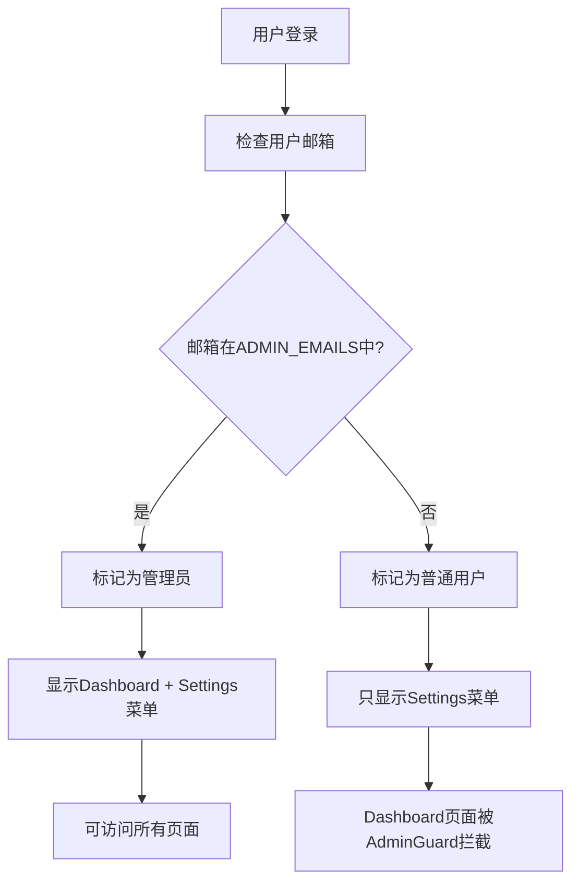

# 基于角色的权限控制系统实现

本文档详细记录了在 Better SaaS 项目中实现基于角色的权限控制系统的完整过程和技术细节。

## 📋 目录

- [实现目标](#实现目标)
- [系统架构](#系统架构)
- [核心组件](#核心组件)
- [实现步骤](#实现步骤)
- [配置说明](#配置说明)
- [使用指南](#使用指南)
- [安全考虑](#安全考虑)
- [开发指南](#开发指南)

## 🎯 实现目标

### 权限区分
- **管理员用户**：可以访问 Dashboard（仪表板）和 Settings（设置）
- **普通用户**：只能访问 Settings（设置）

### 功能要求
- 通过环境变量配置管理员邮箱列表
- 提供便捷的管理员设置工具
- 客户端和服务端双重权限验证
- 用户友好的权限提示界面

## 🏗️ 系统架构

### 权限检查流程



### 技术栈
- **认证系统**：Better Auth + Admin Plugin
- **状态管理**：Zustand
- **权限检查**：自定义权限函数
- **路由保护**：AdminGuard 组件
- **数据库**：PostgreSQL + Drizzle ORM

## 🔧 核心组件

### 1. 权限管理核心 (`src/lib/auth/permissions.ts`)

```typescript
// 核心功能
export function getAdminEmails(): string[]
export function isAdmin(user: User | null): boolean
export function isAdminEmail(email: string): boolean
export function getUserRole(user: User | null): UserRole
export function hasPermission(user: User | null, permission: string): boolean

// 权限常量
export const PERMISSIONS = {
  DASHBOARD_VIEW: 'dashboard.view',
  USERS_MANAGE: 'users.manage',
  FILES_MANAGE: 'files.manage',
  ADMIN_ACCESS: 'admin.access',
  SETTINGS_VIEW: 'settings.view',
  PROFILE_EDIT: 'profile.edit',
  BILLING_VIEW: 'billing.view',
} as const;
```

### 2. 管理员保护组件 (`src/components/admin-guard.tsx`)

```typescript
interface AdminGuardProps {
  children: React.ReactNode;
  fallback?: React.ReactNode;
  redirectTo?: string;
  showAccessDenied?: boolean;
}

export function AdminGuard({
  children,
  fallback,
  redirectTo = '/settings/profile',
  showAccessDenied = true,
}: AdminGuardProps)
```

**功能特性**：
- 自动检查用户管理员权限
- 非管理员用户自动重定向
- 友好的权限拒绝界面
- 支持自定义重定向路径

### 3. 扩展的认证状态管理 (`src/store/auth-store.ts`)

```typescript
// 新增权限相关方法
interface AuthState {
  // ... 原有状态
  
  // Permission methods
  isAdmin: () => boolean;
  getUserRole: () => UserRole;
  hasPermission: (permission: Permission) => boolean;
}

// 新增权限 Hooks
export const useIsAdmin = () => useAuthStore((state) => state.isAdmin());
export const useUserRole = () => useAuthStore((state) => state.getUserRole());
export const useHasPermission = () => useAuthStore((state) => state.hasPermission);
```

### 4. 动态侧边栏 (`src/app/[locale]/(protected)/layout.tsx`)

```typescript
const sidebarGroups: SidebarGroup[] = useMemo(() => {
  const groups: SidebarGroup[] = [];

  // 管理员才能看到 Dashboard 菜单
  if (isAdmin) {
    groups.push({
      title: t('dashboard'),
      items: [/* Dashboard 菜单项 */],
    });
  }

  // 所有登录用户都能看到 Settings 菜单
  groups.push({
    title: t('settings'),
    items: [/* Settings 菜单项 */],
  });

  return groups;
}, [isAdmin, t]);
```

## 📝 实现步骤

### 步骤 1：环境变量配置

**修改 `src/env.ts`**：
```typescript
server: {
  // ... 其他配置
  ADMIN_EMAILS: z.string().optional().default(''),
},

runtimeEnv: {
  // ... 其他配置
  ADMIN_EMAILS: process.env.ADMIN_EMAILS,
},
```

**更新 `env.example`**：
```bash
# Admin Configuration
# Comma-separated list of admin emails
ADMIN_EMAILS="admin@example.com,admin2@example.com"
```

### 步骤 2：权限管理系统

创建 `src/lib/auth/permissions.ts` 实现：
- 管理员邮箱列表获取
- 用户权限检查函数
- 权限常量定义
- 角色枚举和类型定义

### 步骤 3：状态管理扩展

扩展 `src/store/auth-store.ts`：
- 添加权限检查方法到 AuthState
- 实现权限相关的 hooks
- 集成权限函数到状态管理

### 步骤 4：路由保护组件

创建 `src/components/admin-guard.tsx`：
- 实现管理员权限检查
- 处理权限拒绝情况
- 提供友好的用户界面

### 步骤 5：保护 Dashboard 页面

为所有 Dashboard 页面添加 `AdminGuard`：
- `src/app/[locale]/(protected)/dashboard/users/page.tsx`
- `src/app/[locale]/(protected)/dashboard/notifications/page.tsx`
- `src/app/[locale]/(protected)/dashboard/files/page.tsx`

### 步骤 6：动态菜单实现

修改 `src/app/[locale]/(protected)/layout.tsx`：
- 根据用户角色动态生成侧边栏菜单
- 使用 `useMemo` 优化性能
- 集成权限检查 hooks

### 步骤 7：管理员设置工具

创建 `scripts/setup-admin.ts`：
- 实现管理员设置脚本
- 添加完整的错误处理
- 集成日志系统

更新 `package.json`：
```json
{
  "scripts": {
    "admin:setup": "tsx scripts/setup-admin.ts"
  }
}
```

## ⚙️ 配置说明

### 环境变量

| 变量名 | 类型 | 必需 | 说明 |
|--------|------|------|------|
| `ADMIN_EMAILS` | string | 否 | 管理员邮箱列表，用逗号分隔 |

### 数据库字段

用户表 (`user`) 的相关字段：
- `role`: `text` - 用户角色 (`'admin'` 或 `null`/`'user'`)
- `email`: `text` - 用户邮箱（用于管理员匹配）

## 📖 使用指南

### 1. 配置管理员邮箱

在 `.env.local` 文件中设置：
```bash
ADMIN_EMAILS="admin@company.com,manager@company.com"
```

### 2. 设置管理员

确保用户已注册后，运行：
```bash
pnpm admin:setup admin@company.com
```

### 3. 验证权限

管理员登录后应该能看到：
- 完整的侧边栏菜单（Dashboard + Settings）
- 可以访问所有 Dashboard 页面

普通用户登录后只能看到：
- Settings 菜单
- 访问 Dashboard 页面会被重定向

## 🔒 安全考虑

### 1. 双重验证机制

**客户端验证**：
- 用于 UI 显示控制
- 提升用户体验
- 不可作为安全依赖

**服务端验证**：
- `AdminGuard` 组件保护
- 真正的权限控制
- 防止绕过攻击

### 2. 环境变量安全

- 不要将 `.env.local` 提交到版本控制
- 生产环境使用安全的环境变量管理
- 定期审查管理员列表

### 3. 权限检查最佳实践

```typescript
// ✅ 正确：同时进行客户端和服务端检查
function AdminPage() {
  return (
    <AdminGuard> {/* 服务端保护 */}
      <div>
        {useIsAdmin() && <AdminPanel />} {/* 客户端优化 */}
      </div>
    </AdminGuard>
  );
}

// ❌ 错误：仅依赖客户端检查
function AdminPage() {
  const isAdmin = useIsAdmin();
  if (!isAdmin) return <div>Access Denied</div>;
  return <AdminPanel />; // 可被绕过
}
```

## 👨‍💻 开发指南

### 权限检查 API

```typescript
import { isAdmin, hasPermission, PERMISSIONS } from '@/lib/auth/permissions';
import { useIsAdmin, useHasPermission } from '@/store/auth-store';

// 服务端权限检查
const userIsAdmin = isAdmin(user);
const canView = hasPermission(user, PERMISSIONS.DASHBOARD_VIEW);

// 客户端 hooks
const isAdmin = useIsAdmin();
const hasPermission = useHasPermission();
```

### 添加新的权限

1. 在 `PERMISSIONS` 常量中添加新权限
2. 在 `hasPermission` 函数中添加检查逻辑
3. 在需要的地方使用权限检查

```typescript
// 1. 添加权限常量
export const PERMISSIONS = {
  // ... 现有权限
  NEW_FEATURE_ACCESS: 'new.feature.access',
} as const;

// 2. 添加权限逻辑
export function hasPermission(user: User | null, permission: string): boolean {
  const role = getUserRole(user);
  
  switch (permission) {
    // ... 现有权限检查
    case 'new.feature.access':
      return role === UserRole.ADMIN; // 或其他逻辑
    default:
      return false;
  }
}

// 3. 使用权限检查
function NewFeature() {
  const hasAccess = useHasPermission()(PERMISSIONS.NEW_FEATURE_ACCESS);
  
  if (!hasAccess) {
    return <AccessDenied />;
  }
  
  return <FeatureContent />;
}
```

### 扩展角色系统

如需添加更多角色（如 `moderator`），可以：

1. 扩展 `UserRole` 枚举
2. 更新权限检查逻辑
3. 修改数据库 schema
4. 更新管理员设置脚本

```typescript
export enum UserRole {
  ADMIN = 'admin',
  MODERATOR = 'moderator',
  USER = 'user',
}

export function getUserRole(user: User | null): UserRole {
  if (!user?.email) return UserRole.USER;
  
  if (isAdminEmail(user.email)) return UserRole.ADMIN;
  if (isModeratorEmail(user.email)) return UserRole.MODERATOR;
  
  return UserRole.USER;
}
```

## 🔧 故障排除

### 常见问题

1. **用户看不到 Dashboard 菜单**
   - 检查 `ADMIN_EMAILS` 环境变量
   - 确认数据库中用户的 `role` 字段
   - 尝试重新登录

2. **管理员设置脚本失败**
   - 确保数据库连接正常
   - 检查用户是否已注册
   - 验证邮箱格式正确

3. **权限检查不生效**
   - 检查 `AdminGuard` 组件是否正确包装
   - 确认权限函数导入正确
   - 查看浏览器控制台错误

### 调试技巧

```typescript
// 调试权限状态
function DebugPermissions() {
  const user = useUser();
  const isAdmin = useIsAdmin();
  const role = useUserRole();
  
  console.log('Debug Info:', {
    user: user?.email,
    isAdmin,
    role,
    adminEmails: getAdminEmails(),
  });
  
  return null;
}
```

## 📚 相关文档

- [管理员设置指南](./admin-setup.md)
- [Better Auth 官方文档](https://better-auth.com)
- [Zustand 状态管理](https://github.com/pmndrs/zustand)

## 🎉 总结

本权限控制系统实现了：

- ✅ 基于邮箱的管理员配置
- ✅ 动态权限检查和菜单显示
- ✅ 双重安全验证机制
- ✅ 用户友好的界面设计
- ✅ 完整的开发工具支持
- ✅ 可扩展的权限架构

系统具有良好的安全性、可维护性和用户体验，为后续功能扩展奠定了坚实基础。 