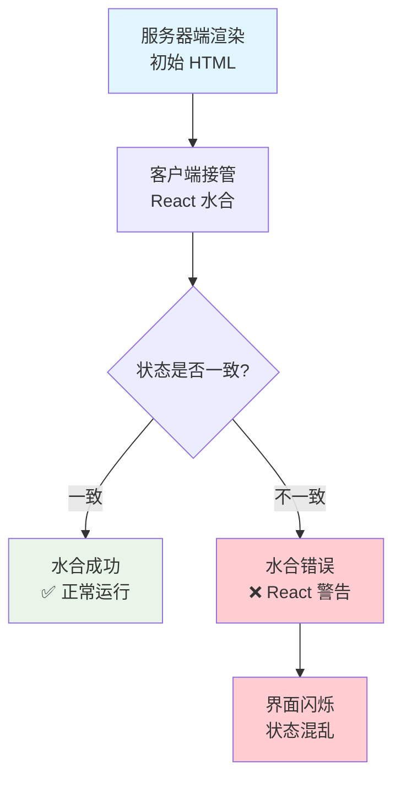
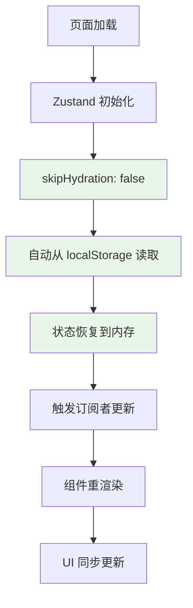
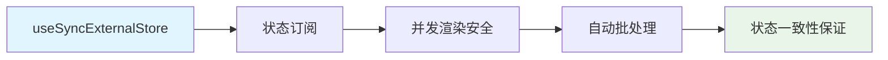
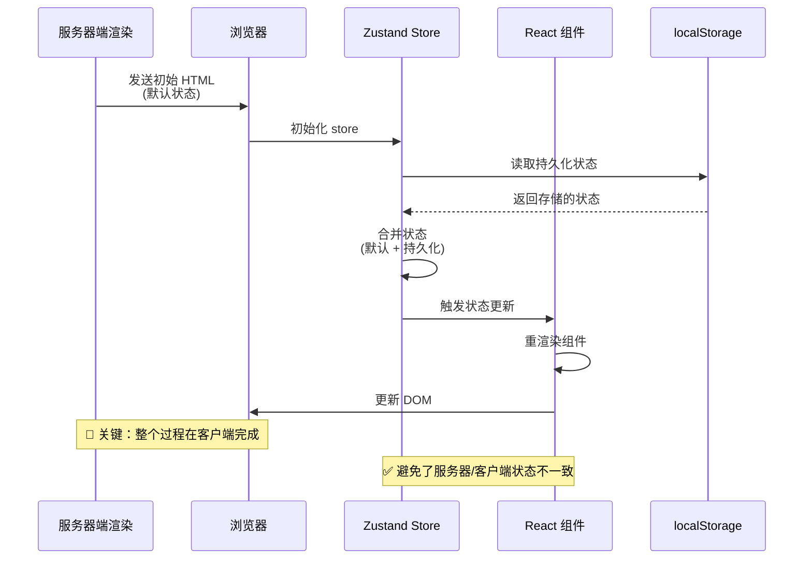
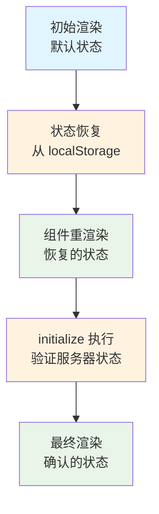

# Zustand 水合原理深度分析

## 概述

本文档深度分析当前 Zustand persist 方案能够避免 SSR 水合错误的技术原理，揭示背后的多层机制。

## 水合错误的根本原因

### 什么是水合错误？



**水合错误的典型场景：**

- 服务器端：`isAuthenticated: false`（默认值）
- 客户端：`isAuthenticated: true`（从 localStorage 恢复）
- 结果：React 检测到不一致，抛出水合警告

## 当前方案的多层防护机制

### 第一层：useSyncExternalStore 的状态同步

```typescript
// Zustand 5.x 内部实现（简化版）
function useStore(selector) {
  return useSyncExternalStore(
    store.subscribe,           // 订阅函数
    () => selector(store.getState()), // 客户端状态获取
    () => selector(getServerSnapshot()) // 服务器端状态获取
  );
}
```

**关键机制：**
1. **getServerSnapshot**：返回服务器端的初始状态
2. **getSnapshot**：返回客户端的当前状态
3. **自动同步**：React 18 确保两者一致

### 第二层：skipHydration: false 的自动恢复



**时序分析：**
```typescript
// 1. 页面加载时
const initialState = { user: null, isAuthenticated: false }; // 服务器端默认值

// 2. Zustand persist 自动执行
const storedState = localStorage.getItem('better-saas-auth');
const parsedState = JSON.parse(storedState); // { user: {...}, isAuthenticated: true }

// 3. 状态合并
const hydratedState = { ...initialState, ...parsedState };

// 4. 触发重渲染
store.setState(hydratedState);
```

### 第三层：partialize 的精确控制

```typescript
partialize: (state) => ({
  user: state.user,
  isAuthenticated: state.isAuthenticated,
  lastUpdated: state.lastUpdated,
  cacheExpiry: state.cacheExpiry,
})
```

**为什么这很重要？**

- **只持久化稳定状态**：避免临时状态导致的不一致
- **排除 UI 状态**：`isLoading`, `error`, `isInitialized` 不持久化
- **确保默认值**：未持久化的状态始终使用默认值

### 第四层：React 18 的并发安全



## 详细工作流程

### 完整的水合过程



### 关键时机分析

```typescript
// 时间线分析
0ms    - 页面开始加载
10ms   - HTML 解析完成，显示默认状态
20ms   - JavaScript 开始执行
30ms   - Zustand store 初始化
35ms   - persist 中间件读取 localStorage
40ms   - 状态合并完成
45ms   - 触发组件重渲染
50ms   - AuthProvider useEffect 执行
60ms   - initialize() 开始执行
70ms   - 缓存检查（可能跳过服务器请求）
100ms  - 最终状态确定，UI 稳定
```

## 为什么这种方案避免了水合错误？

### 1. 状态恢复在客户端完成

```typescript
// ❌ 错误方案：服务器端尝试猜测客户端状态
function getServerSnapshot() {
  // 服务器端无法访问 localStorage
  return { isAuthenticated: ??? }; // 无法确定
}

// ✅ 正确方案：服务器端使用一致的默认值
function getServerSnapshot() {
  return { isAuthenticated: false }; // 始终一致
}
```

### 2. useSyncExternalStore 的智能处理

```typescript
// React 18 内部逻辑（简化）
function useSyncExternalStore(subscribe, getSnapshot, getServerSnapshot) {
  const serverSnapshot = getServerSnapshot?.();
  const clientSnapshot = getSnapshot();
  
  // 在水合期间，优先使用服务器端快照
  if (isHydrating) {
    return serverSnapshot;
  }
  
  // 水合完成后，使用客户端快照
  return clientSnapshot;
}
```

### 3. 渐进式状态更新



### 4. 完整的时序流程

```typescript
// 1. 服务器端渲染阶段
SSR: {
  user: null,
  isAuthenticated: false,
  isInitialized: false  // 🎯 显示骨架屏
}
// 渲染结果: <div class="animate-pulse">骨架屏</div>

// 2. 客户端水合阶段
Hydration: {
  user: null,
  isAuthenticated: false,
  isInitialized: false  // 🎯 仍然显示骨架屏
}
// 渲染结果: <div class="animate-pulse">骨架屏</div> ✅ 与服务器端一致

// 3. Persist 异步恢复阶段
Persist Restore: {
  user: { id: "123", name: "张三" },
  isAuthenticated: true,
  isInitialized: false  // 🎯 仍然显示骨架屏
}
// 渲染结果: <div class="animate-pulse">骨架屏</div> ✅ 状态变了但UI不变

// 4. 初始化完成阶段
Initialized: {
  user: { id: "123", name: "张三" },
  isAuthenticated: true,
  isInitialized: true   // 🎯 现在显示真实内容
}
// 渲染结果: <UserAvatarMenu /> ✅ 安全地显示真实状态
```


## 对比其他方案

### 方案对比：状态恢复时机

| 方案 | 状态恢复时机 | 水合安全性 | 复杂度 |
|------|-------------|-----------|--------|
| **当前方案** | 客户端自动恢复 | ✅ 完全安全 | 低 |
| **手动水合** | 手动控制时机 | ⚠️ 需要正确实现 | 高 |
| **无持久化** | 每次重新获取 | ✅ 安全但慢 | 中等 |
| **SSR 状态注入** | 服务器端注入 | ❌ 容易出错 | 很高 |

### 错误方案示例

**❌ 常见错误：服务器端猜测状态**
```typescript
// 危险的实现
function getServerSnapshot() {
  // 试图在服务器端读取 cookie 或其他状态
  const token = cookies().get('auth-token');
  return { isAuthenticated: !!token }; // ⚠️ 可能与客户端不一致
}
```

**✅ 正确方案：一致的默认值**
```typescript
function getServerSnapshot() {
  // 始终返回安全的默认值
  return { 
    user: null, 
    isAuthenticated: false,
    lastUpdated: 0,
    cacheExpiry: 10 * 60 * 1000
  };
}
```

## 性能优化的额外好处

### 缓存机制避免不必要的请求

```typescript
initialize: async () => {
  if (get().isInitialized) return; // 避免重复初始化
  
  // 🎯 关键：缓存检查
  if (get().isCacheValid()) {
    set({ isLoading: false, isInitialized: true });
    return; // 跳过服务器验证
  }
  
  // 只在缓存失效时才请求服务器
  const session = await authClient.getSession();
  // ...
}
```

**性能数据：**
- 缓存命中：0 个网络请求
- 缓存失效：1 个网络请求
- 传统方案：每次都需要网络请求

## 潜在的边缘情况

### 1. localStorage 被禁用

```typescript
// Zustand persist 内置处理
storage: createJSONStorage(() => {
  try {
    return localStorage;
  } catch {
    // 自动降级到内存存储
    return {
      getItem: () => null,
      setItem: () => {},
      removeItem: () => {}
    };
  }
})
```

### 2. 状态版本不兼容

```typescript
{
  version: 1,
  migrate: (persistedState, version) => {
    if (version === 0) {
      // 处理旧版本状态
      return { ...persistedState, newField: defaultValue };
    }
    return persistedState;
  }
}
```

### 3. 并发渲染冲突

```typescript
// useSyncExternalStore 自动处理
// 确保在并发渲染中状态的一致性
```

## 总结

当前方案避免水合错误的原理是**多层机制的协同作用**：

### 🎯 **核心机制**
1. **useSyncExternalStore**：确保服务器/客户端状态同步
2. **skipHydration: false**：启用自动状态恢复
3. **partialize 精确控制**：只持久化稳定状态
4. **React 18 并发安全**：处理复杂的渲染场景

### 🚀 **关键优势**
- **零配置**：框架自动处理复杂逻辑
- **高性能**：智能缓存减少网络请求
- **完全安全**：多层防护避免状态不一致
- **向前兼容**：利用最新的 React 18 特性

### 💡 **设计哲学**
这个方案体现了 **"相信框架，简化代码"** 的理念。通过正确配置和使用现代框架的内置功能，我们获得了比手动实现更可靠、更高效的解决方案。

---

*文档创建时间：2024年12月*  
*深度分析 Zustand 5.x + React 18 水合机制* 