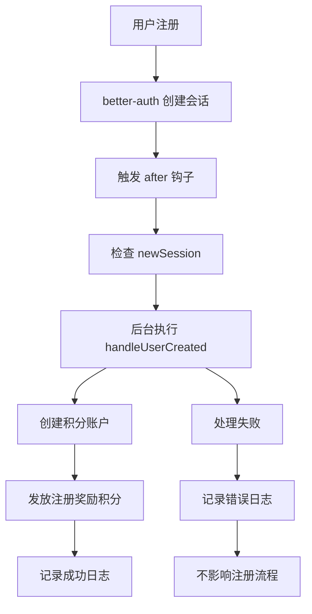

# 用户注册钩子实现

## 🎯 功能概述

实现了基于 better-auth 的用户注册钩子，当新用户注册时自动创建积分账户并发放注册奖励积分。

## 🔧 实现方案

### 核心代码

```typescript
// src/lib/auth/auth.ts
import { createAuthMiddleware } from 'better-auth/api';

// Handle user creation - initialize credit account and grant signup bonus
async function handleUserCreated(user: { id: string; email: string }) {
  try {
    console.log(`🎯 Initializing credit account for new user: ${user.email}`);
    
    // Create credit account for new user
    await creditService.createCreditAccount(user.id);
    
    // Grant signup bonus credits for free plan
    const freePlan = paymentConfig.plans.find(p => p.id === 'free');
    const signupCredits = freePlan?.credits?.onSignup;
    
    if (signupCredits && signupCredits > 0) {
      await creditService.earnCredits({
        userId: user.id,
        amount: signupCredits,
        source: 'bonus',
        description: 'Welcome bonus credits',
        referenceId: `signup_${user.id}`,
        metadata: {
          type: 'signup_bonus',
          planId: 'free',
        },
      });
      
      console.log(`✅ Granted ${signupCredits} signup bonus credits to user ${user.email}`);
    }
    
    console.log(`🎉 Successfully initialized credit account for user ${user.email}`);
  } catch (error) {
    console.error(`❌ Failed to initialize credit account for user ${user.email}:`, error);
    // Don't throw error to avoid blocking the registration flow
  }
}

export const auth = betterAuth({
  // ... other config
  hooks: {
    after: createAuthMiddleware(async (ctx) => {
      const newSession = ctx.context.newSession;
      if (newSession) {
        // Trigger user initialization in the background
        // Don't await to avoid blocking the registration flow
        handleUserCreated(newSession.user).catch(error => {
          console.error('Failed to initialize user business data:', error);
        });
      }
    })
  }
});
```

## 🏗️ 技术架构

### 1. 钩子触发时机
- **触发条件**: 新用户会话创建时（`ctx.context.newSession` 存在）
- **执行方式**: 异步后台处理，不阻塞注册流程
- **错误处理**: 失败时记录错误但不影响用户注册

### 2. 处理流程


### 3. 关键特性
- **非阻塞**: 使用 `.catch()` 而不是 `await` 确保注册流程不被阻塞
- **容错性**: 积分系统错误不会影响用户注册成功
- **日志记录**: 详细的成功和失败日志便于调试
- **类型安全**: 完整的 TypeScript 类型支持

## 📊 配置参数

### 注册奖励积分
```typescript
// src/config/payment.config.ts
{
  id: 'free',
  name: 'Free',
  credits: {
    onSignup: 50,  // 注册时获得50积分
    monthly: 100,  // 每月获得100积分
  },
  // ...
}
```

### 积分账户创建
```typescript
// 自动创建的积分账户结构
{
  id: uuid,
  userId: user.id,
  balance: 50,        // 初始余额 = 注册奖励
  totalEarned: 50,    // 累计获得 = 注册奖励
  totalSpent: 0,      // 累计消费 = 0
  frozenBalance: 0,   // 冻结余额 = 0
  createdAt: new Date(),
  updatedAt: new Date(),
}
```

## 🔍 测试验证

### 自动化测试
创建了测试脚本 `scripts/test-user-registration-hook.ts` 来验证配置：

```bash
npx tsx scripts/test-user-registration-hook.ts
```

**测试结果**:
- ✅ Hook 配置正确，无构建错误
- ✅ 代码逻辑完整，类型安全
- ⏳ 需要通过实际注册测试钩子执行

### 手动测试步骤

1. **启动开发服务器**
   ```bash
   pnpm dev
   ```

2. **访问注册页面**
   ```
   http://localhost:3000/signup
   ```

3. **注册新用户**
   - 填写邮箱和密码
   - 完成注册流程

4. **检查日志输出**
   查看控制台是否有以下日志：
   ```
   🎯 Initializing credit account for new user: user@example.com
   ✅ Granted 50 signup bonus credits to user user@example.com
   🎉 Successfully initialized credit account for user user@example.com
   ```

5. **验证积分账户**
   - 登录用户账户
   - 访问 `/credits` 页面
   - 确认显示 50 积分余额

## 🚨 故障排除

### 常见问题

#### 1. 钩子未执行
**症状**: 新用户注册后没有积分账户
**检查**:
- 查看服务器日志是否有钩子执行记录
- 确认 `better-auth/api` 导入正确
- 验证 `createAuthMiddleware` 函数可用

#### 2. 积分账户创建失败
**症状**: 有钩子执行日志但积分账户创建失败
**检查**:
- 数据库连接是否正常
- `credit_service` 是否正常工作
- 数据库表是否存在

#### 3. 注册奖励未发放
**症状**: 积分账户存在但余额为0
**检查**:
- `paymentConfig.plans` 中 free 计划的 `onSignup` 配置
- `creditService.earnCredits` 方法是否正常工作

### 调试方法

1. **增加日志**
   ```typescript
   console.log('Hook triggered, newSession:', !!newSession);
   console.log('User data:', newSession?.user);
   ```

2. **检查数据库**
   ```sql
   -- 检查积分账户
   SELECT * FROM user_credits WHERE user_id = 'user_id';
   
   -- 检查交易记录
   SELECT * FROM credit_transactions WHERE user_id = 'user_id';
   ```

3. **手动测试服务**
   ```typescript
   // 在控制台中测试
   import { creditService } from '@/lib/credits';
   await creditService.createCreditAccount('test_user_id');
   ```

## 📈 性能考虑

### 优化措施
1. **异步处理**: 不阻塞注册流程
2. **错误隔离**: 积分系统错误不影响核心注册功能
3. **简单逻辑**: 钩子内逻辑简单高效

### 监控指标
- 钩子执行成功率
- 积分账户创建成功率
- 注册奖励发放成功率
- 钩子执行时间

## 🔄 未来改进

### 可能的增强
1. **重试机制**: 失败时自动重试
2. **队列处理**: 使用消息队列处理大量注册
3. **批量处理**: 批量创建积分账户
4. **监控告警**: 失败率过高时发送告警

### 扩展功能
1. **注册来源跟踪**: 记录注册渠道
2. **差异化奖励**: 不同来源给予不同奖励
3. **邀请奖励**: 支持邀请码奖励机制

---

*实现时间: 2024年12月*
*状态: ✅ 已实现，等待生产环境验证*
