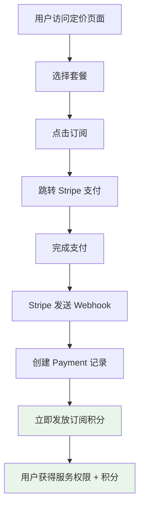
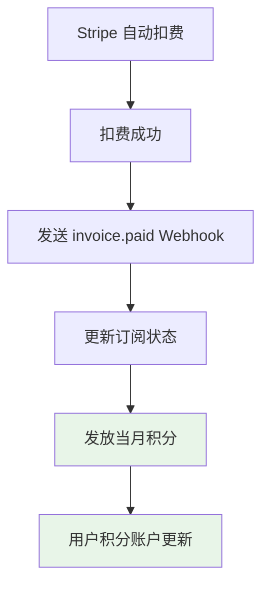
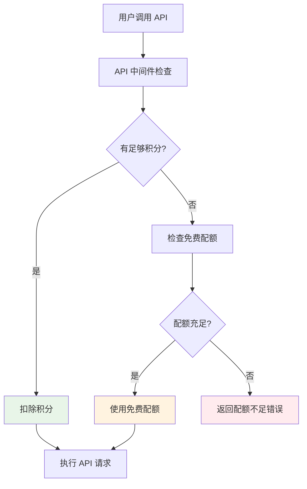
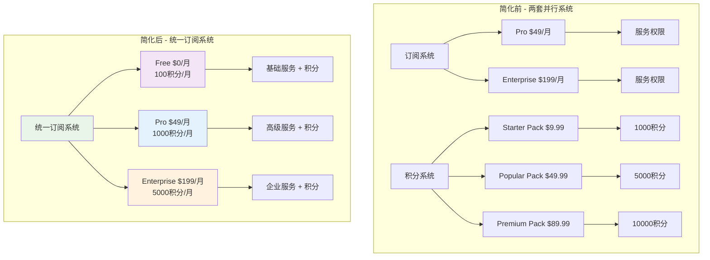

# 积分系统设计方案 3.0 - 基于订阅的积分系统

## 🎯 设计理念

将积分系统与现有订阅系统深度整合，用户订阅不同套餐时自动获得相应积分，简化支付流程和系统复杂度。

## 📋 核心概念

### 统一支付模式
- **取消独立积分购买**：不再有单独的积分包购买
- **订阅即获得积分**：用户订阅套餐时自动获得积分
- **按周期发放**：每个计费周期自动补充积分
- **简化用户体验**：一次订阅，获得服务+积分

### 积分与订阅的关系

| 订阅套餐 | 月费 | 每月积分 | 年费 | 每年积分 | 积分用途 |
|----------|------|----------|------|----------|----------|
| **Free** | $0 | 100 | - | - | 基础 API 调用 |
| **Pro** | $49 | 1000 | $499 | 12000 | API 调用 + 存储 |
| **Enterprise** | $199 | 5000 | $1999 | 60000 | 高级 API + 大量存储 |

## 🏗️ 系统架构

### 1. 数据库设计

#### 保留现有表结构
```sql
-- 用户积分账户表（保持不变）
CREATE TABLE user_credits (
  id TEXT PRIMARY KEY,
  user_id TEXT UNIQUE NOT NULL REFERENCES user(id),
  balance INTEGER NOT NULL DEFAULT 0,
  total_earned INTEGER NOT NULL DEFAULT 0,
  total_spent INTEGER NOT NULL DEFAULT 0,
  frozen_balance INTEGER NOT NULL DEFAULT 0,
  created_at TIMESTAMP DEFAULT CURRENT_TIMESTAMP,
  updated_at TIMESTAMP DEFAULT CURRENT_TIMESTAMP
);

-- 积分交易记录表（保持不变）
CREATE TABLE credit_transactions (
  id TEXT PRIMARY KEY,
  user_id TEXT NOT NULL REFERENCES user(id),
  type TEXT NOT NULL CHECK (type IN ('earn', 'spend', 'refund', 'admin_adjust', 'freeze', 'unfreeze')),
  amount INTEGER NOT NULL,
  balance_after INTEGER NOT NULL,
  source TEXT NOT NULL CHECK (source IN ('subscription', 'api_call', 'admin', 'storage', 'bonus')),
  description TEXT,
  reference_id TEXT,
  metadata TEXT,
  created_at TIMESTAMP DEFAULT CURRENT_TIMESTAMP
);

-- 用户配额使用表（保持不变）
CREATE TABLE user_quota_usage (
  id TEXT PRIMARY KEY,
  user_id TEXT NOT NULL REFERENCES user(id),
  service TEXT NOT NULL CHECK (service IN ('api_call', 'storage', 'custom')),
  period TEXT NOT NULL, -- 格式: YYYY-MM
  used_amount INTEGER NOT NULL DEFAULT 0,
  created_at TIMESTAMP DEFAULT CURRENT_TIMESTAMP,
  updated_at TIMESTAMP DEFAULT CURRENT_TIMESTAMP,
  UNIQUE(user_id, service, period)
);

-- 删除不再需要的表
-- DROP TABLE credit_packages; -- 不再需要独立积分包
```

#### 扩展现有订阅配置

```typescript
// src/config/payment.config.ts
export const paymentConfig: PaymentConfig = {
  plans: [
    {
      id: 'free',
      name: 'Free',
      price: 0,
      interval: null,
      credits: {
        monthly: 100,    // 每月免费积分
        onSignup: 100,   // 注册赠送积分
      },
      features: [
        '100 credits per month',
        'Basic API access',
        '1GB storage',
      ],
      limits: {
        apiCalls: 100,
        storage: 1,
      },
    },
    {
      id: 'pro',
      name: 'Pro',
      price: 49,
      yearlyPrice: 499,
      interval: 'month',
      stripePriceIds: {
        monthly: process.env.NEXT_PUBLIC_STRIPE_PRICE_PRO_MONTHLY,
        yearly: process.env.NEXT_PUBLIC_STRIPE_PRICE_PRO_YEARLY,
      },
      credits: {
        monthly: 1000,     // 每月积分
        yearly: 12000,     // 年付积分（多送2个月）
        onSubscribe: 1000, // 订阅时立即获得
      },
      features: [
        '1,000 credits per month',
        'Advanced API access',
        '10GB storage',
        'Priority support',
      ],
      limits: {
        apiCalls: 10000,
        storage: 10,
      },
    },
    {
      id: 'enterprise',
      name: 'Enterprise',
      price: 199,
      yearlyPrice: 1999,
      interval: 'month',
      stripePriceIds: {
        monthly: process.env.NEXT_PUBLIC_STRIPE_PRICE_ENTERPRISE_MONTHLY,
        yearly: process.env.NEXT_PUBLIC_STRIPE_PRICE_ENTERPRISE_YEARLY,
      },
      credits: {
        monthly: 5000,     // 每月积分
        yearly: 60000,     // 年付积分
        onSubscribe: 5000, // 订阅时立即获得
      },
      features: [
        '5,000 credits per month',
        'Enterprise API access',
        'Unlimited storage',
        'Dedicated support',
      ],
      limits: {
        apiCalls: 100000,
        storage: -1, // unlimited
      },
    },
  ],
};
```

### 2. 积分发放逻辑

#### 订阅时立即发放
```typescript
// src/app/api/webhooks/stripe/route.ts
async function handleCheckoutSessionCompleted(event: StripeTypes.Event) {
  const session = event.data.object as StripeTypes.Checkout.Session;
  
  if (session.mode === 'subscription' && session.subscription) {
    // ... 现有订阅处理逻辑
    
    // 新增：订阅时发放积分
    await grantSubscriptionCredits(userId, subscriptionData);
  }
}

async function grantSubscriptionCredits(userId: string, subscription: any) {
  const plan = findPlanByPriceId(subscription.priceId);
  if (!plan?.credits) return;
  
  // 计算应发放的积分
  const isYearly = subscription.interval === 'year';
  const creditsToGrant = isYearly ? plan.credits.yearly : plan.credits.monthly;
  
  // 发放积分
  await creditService.earnCredits({
    userId,
    amount: creditsToGrant,
    source: 'subscription',
    description: `${plan.name} subscription credits`,
    referenceId: subscription.id,
  });
}
```

#### 每月自动续费时发放
```typescript
// src/app/api/webhooks/stripe/route.ts
async function handleInvoicePaid(event: StripeTypes.Event) {
  const invoice = event.data.object as InvoiceWithSubscription;
  
  if (invoice.subscription) {
    // ... 现有逻辑
    
    // 新增：续费时发放积分
    await grantMonthlyCredits(userId, subscriptionData);
  }
}

async function grantMonthlyCredits(userId: string, subscription: any) {
  const plan = findPlanByPriceId(subscription.priceId);
  if (!plan?.credits?.monthly) return;
  
  // 每月续费时发放积分
  await creditService.earnCredits({
    userId,
    amount: plan.credits.monthly,
    source: 'subscription',
    description: `Monthly ${plan.name} credits`,
    referenceId: `${subscription.id}_${new Date().getMonth()}`,
  });
}
```

### 3. 免费用户积分处理

#### 定时任务发放免费积分
```typescript
// src/server/cron/monthly-credits.ts
export async function grantMonthlyFreeCredits() {
  console.log('🎁 Granting monthly free credits...');
  
  // 获取所有免费用户（没有活跃订阅的用户）
  const freeUsers = await db
    .select({ userId: user.id })
    .from(user)
    .leftJoin(payment, eq(payment.userId, user.id))
    .where(
      or(
        isNull(payment.status),
        not(inArray(payment.status, ['active', 'trialing']))
      )
    );
  
  const freeCredits = paymentConfig.plans.find(p => p.id === 'free')?.credits?.monthly || 100;
  
  for (const user of freeUsers) {
    await creditService.earnCredits({
      userId: user.userId,
      amount: freeCredits,
      source: 'subscription',
      description: 'Monthly free credits',
      referenceId: `free_${new Date().toISOString().slice(0, 7)}`, // YYYY-MM
    });
  }
  
  console.log(`✅ Granted ${freeCredits} credits to ${freeUsers.length} free users`);
}
```

## 🔄 业务流程

### 用户订阅流程


### 每月续费流程


### 积分消费流程


## 🛠️ 实现方案

### 1. 修改现有代码

#### 更新 Stripe Webhook 处理
```typescript
// src/app/api/webhooks/stripe/route.ts
async function handleCheckoutSessionCompleted(event: StripeTypes.Event) {
  const session = event.data.object as StripeTypes.Checkout.Session;
  
  if (session.mode === 'subscription' && session.subscription) {
    // ... 现有的 payment 记录创建逻辑
    
    // 新增：发放订阅积分
    const plan = paymentConfig.plans.find(p => 
      p.stripePriceIds?.monthly === priceId || 
      p.stripePriceIds?.yearly === priceId
    );
    
    if (plan?.credits) {
      const isYearly = price.recurring?.interval === 'year';
      const creditsToGrant = plan.credits.onSubscribe || 
        (isYearly ? plan.credits.yearly : plan.credits.monthly);
      
      await creditService.earnCredits({
        userId,
        amount: creditsToGrant,
        source: 'subscription',
        description: `${plan.name} subscription credits`,
        referenceId: subscriptionId,
      });
      
      console.log(`✅ Granted ${creditsToGrant} credits to user ${userId}`);
    }
  }
}

async function handleInvoicePaid(event: StripeTypes.Event) {
  const invoice = event.data.object as InvoiceWithSubscription;
  
  if (invoice.subscription) {
    const subscriptionId = typeof invoice.subscription === 'string' 
      ? invoice.subscription 
      : invoice.subscription.id;
      
    const paymentRecord = await paymentRepository.findBySubscriptionId(subscriptionId);
    
    if (paymentRecord) {
      // ... 现有的事件记录逻辑
      
      // 新增：每月发放积分（跳过第一次，因为订阅时已经发放）
      const isFirstPayment = invoice.billing_reason === 'subscription_create';
      
      if (!isFirstPayment) {
        const plan = paymentConfig.plans.find(p => 
          p.stripePriceIds?.monthly === paymentRecord.priceId || 
          p.stripePriceIds?.yearly === paymentRecord.priceId
        );
        
        if (plan?.credits?.monthly) {
          await creditService.earnCredits({
            userId: paymentRecord.userId,
            amount: plan.credits.monthly,
            source: 'subscription',
            description: `Monthly ${plan.name} credits`,
            referenceId: `${subscriptionId}_${invoice.id}`,
          });
          
          console.log(`✅ Granted monthly ${plan.credits.monthly} credits to user ${paymentRecord.userId}`);
        }
      }
    }
  }
}
```

#### 更新用户注册时的积分发放
```typescript
// src/server/actions/auth-actions.ts
export async function handleUserRegistration(userId: string) {
  // 创建积分账户
  await db.insert(userCredits).values({
    id: crypto.randomUUID(),
    userId,
    balance: 0,
    totalEarned: 0,
    totalSpent: 0,
    frozenBalance: 0,
  });
  
  // 发放注册奖励积分
  const freePlan = paymentConfig.plans.find(p => p.id === 'free');
  const signupCredits = freePlan?.credits?.onSignup || 100;
  
  await creditService.earnCredits({
    userId,
    amount: signupCredits,
    source: 'subscription',
    description: 'Welcome bonus credits',
    referenceId: `signup_${userId}`,
  });
}
```

### 2. 简化前端界面

#### 更新定价页面
```typescript
// src/components/blocks/pricing/pricing.tsx
const PricingCard = ({ plan }: { plan: Plan }) => {
  return (
    <div className="pricing-card">
      <h3>{plan.name}</h3>
      <div className="price">${plan.price}/month</div>
      
      {/* 突出显示积分信息 */}
      <div className="credits-info">
        <div className="credits-badge">
          {plan.credits?.monthly || 0} Credits/month
        </div>
        {plan.credits?.onSubscribe && (
          <div className="bonus-credits">
            + {plan.credits.onSubscribe} bonus credits on signup
          </div>
        )}
      </div>
      
      <ul className="features">
        {plan.features.map(feature => (
          <li key={feature}>{feature}</li>
        ))}
      </ul>
      
      <button onClick={() => handleSubscribe(plan)}>
        {plan.id === 'free' ? 'Get Started' : 'Subscribe Now'}
      </button>
    </div>
  );
};
```

#### 简化积分页面
```typescript
// src/app/[locale]/(protected)/credits/page.tsx
export default function CreditsPage() {
  return (
    <div className="credits-page">
      <CreditBalance />
      
      {/* 移除购买积分部分，改为升级提示 */}
      <div className="upgrade-prompt">
        <h2>Need More Credits?</h2>
        <p>Upgrade your subscription to get more credits every month!</p>
        <Link href="/pricing" className="upgrade-button">
          View Plans
        </Link>
      </div>
      
      <CreditHistory />
      <QuotaOverview />
    </div>
  );
}
```

### 3. 定时任务设置

#### 创建月度积分发放任务
```typescript
// src/server/cron/index.ts
import { grantMonthlyFreeCredits } from './monthly-credits';

// 每月1号凌晨2点执行
export const monthlyCreditsJob = {
  schedule: '0 2 1 * *', // cron expression
  handler: grantMonthlyFreeCredits,
};

// 在 Vercel/其他平台设置定时任务
// 或使用 GitHub Actions 定时触发
```

## 📊 配置更新

### 环境变量（无需改动）
```env
# 现有的 Stripe 配置保持不变
NEXT_PUBLIC_STRIPE_PRICE_PRO_MONTHLY=price_xxx
NEXT_PUBLIC_STRIPE_PRICE_PRO_YEARLY=price_xxx
NEXT_PUBLIC_STRIPE_PRICE_ENTERPRISE_MONTHLY=price_xxx
NEXT_PUBLIC_STRIPE_PRICE_ENTERPRISE_YEARLY=price_xxx

# 删除不再需要的积分包 Price ID
# STRIPE_PRICE_CREDIT_STARTER=price_xxx  # 删除
# STRIPE_PRICE_CREDIT_POPULAR=price_xxx  # 删除
# STRIPE_PRICE_CREDIT_PREMIUM=price_xxx  # 删除
```

### 积分消费配置
```typescript
// src/config/credits.config.ts
export const creditsConfig = {
  enabled: true,
  currency: 'credits',
  
  // 消费规则
  consumption: {
    apiCall: {
      costPerCall: 1,        // 每次 API 调用消耗1积分
      freeQuotaCalls: 0,     // 付费用户无免费配额，全部使用积分
    },
    storage: {
      costPerGBPerMonth: 10, // 每GB每月消耗10积分
      freeQuotaGB: 0,        // 付费用户无免费配额
    },
  },
  
  // 免费用户配额
  freeUser: {
    apiCall: {
      freeQuotaCalls: 100,   // 免费用户每月100次免费调用
    },
    storage: {
      freeQuotaGB: 1,        // 免费用户1GB免费存储
    },
  },
};
```

## 🚀 迁移方案

### 1. 数据迁移脚本
```typescript
// scripts/migrate-to-subscription-credits.ts
import 'dotenv/config';
import db from '@/server/db';
import { creditPackages, creditTransactions } from '@/server/db/schema';

async function migrateToSubscriptionCredits() {
  console.log('🔄 Migrating to subscription-based credits...');
  
  // 1. 删除独立积分包表
  console.log('🗑️  Removing credit packages table...');
  await db.execute(sql`DROP TABLE IF EXISTS credit_packages`);
  
  // 2. 清理积分购买相关的交易记录
  console.log('🧹 Cleaning up credit purchase transactions...');
  await db
    .delete(creditTransactions)
    .where(eq(creditTransactions.source, 'purchase'));
  
  // 3. 为现有订阅用户补发积分
  console.log('💎 Granting credits to existing subscribers...');
  const activeSubscriptions = await db
    .select()
    .from(payment)
    .where(inArray(payment.status, ['active', 'trialing']));
  
  for (const subscription of activeSubscriptions) {
    const plan = paymentConfig.plans.find(p => 
      p.stripePriceIds?.monthly === subscription.priceId || 
      p.stripePriceIds?.yearly === subscription.priceId
    );
    
    if (plan?.credits) {
      const isYearly = subscription.interval === 'year';
      const creditsToGrant = isYearly ? plan.credits.yearly : plan.credits.monthly;
      
      await creditService.earnCredits({
        userId: subscription.userId,
        amount: creditsToGrant,
        source: 'subscription',
        description: `Migration: ${plan.name} subscription credits`,
        referenceId: `migration_${subscription.id}`,
      });
    }
  }
  
  console.log('✅ Migration completed successfully!');
}
```

### 2. 部署步骤
```bash
# 1. 更新代码
git pull origin main

# 2. 运行迁移脚本
npx tsx scripts/migrate-to-subscription-credits.ts

# 3. 重启应用
# (Vercel 会自动重新部署)

# 4. 验证功能
npx tsx scripts/check-credit-system.ts
```

## 📈 优势分析

### 1. 系统简化
- **统一支付流程**：只需要维护一套订阅系统
- **减少代码复杂度**：删除独立积分购买相关代码
- **降低维护成本**：减少 Stripe 产品配置和管理



### 2. 用户体验提升
- **简化决策**：用户只需选择订阅套餐，不用纠结积分包
- **持续服务**：订阅用户每月自动获得积分，无需手动购买
- **价值感知**：用户更容易理解"订阅=服务+积分"的价值

### 3. 商业模式优化
- **稳定收入**：订阅模式比一次性购买更稳定
- **用户留存**：订阅用户的留存率通常更高
- **价值递增**：可以通过升级套餐获得更多积分

### 4. 技术架构优化
- **数据库简化**：删除 `credit_packages` 表
- **API 简化**：删除积分购买相关 API
- **配置简化**：减少 Stripe Price ID 配置

## 🎯 实施建议

### 阶段1：代码重构（1-2天）
1. 更新 `payment.config.ts` 添加积分配置
2. 修改 Stripe webhook 处理逻辑
3. 更新前端定价页面和积分页面
4. 创建迁移脚本

### 阶段2：测试验证（1天）
1. 测试订阅流程和积分发放
2. 测试续费时的积分发放
3. 测试积分消费功能
4. 验证免费用户体验

### 阶段3：数据迁移（半天）
1. 备份现有数据
2. 运行迁移脚本
3. 验证迁移结果
4. 清理旧代码和配置

### 阶段4：上线监控（持续）
1. 监控积分发放是否正常
2. 监控用户反馈
3. 优化用户体验
4. 调整积分配置

## 📝 总结

这个基于订阅的积分系统设计具有以下特点：

1. **🎯 简化架构**：将积分系统与订阅系统深度整合
2. **💰 统一支付**：用户只需要订阅，无需单独购买积分
3. **🔄 自动发放**：订阅和续费时自动发放积分
4. **📱 优化体验**：简化用户决策和操作流程
5. **🛠️ 易于维护**：减少代码复杂度和配置管理

这个方案既保持了积分系统的灵活性，又大大简化了系统复杂度，是一个更加优雅和实用的解决方案！
