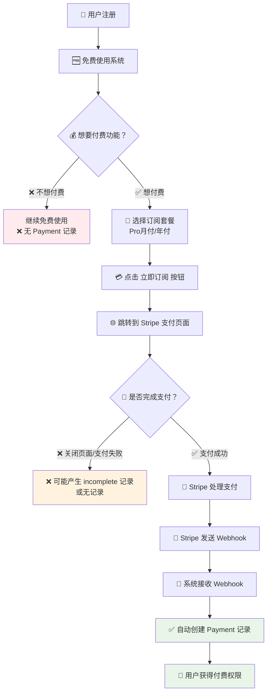
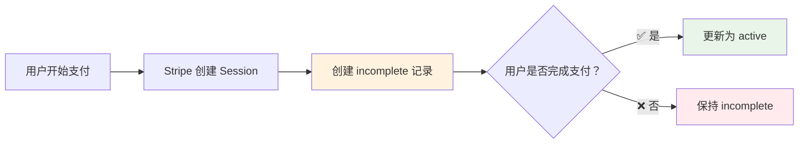

# 订阅系统 Payment 表自动创建原理详解

## 🤔 问题：为什么 Payment 表数据是"自动"创建的？

很多人可能会疑惑：既然是"自动"创建，为什么不是所有用户都有支付记录？让我用最简单的方式来解释这个机制。

## 🏪 用生活中的例子来理解

想象一下你去商店买东西：

1. **进店浏览**（用户注册）→ 不产生购买记录
2. **选择商品**（选择订阅套餐）→ 不产生购买记录  
3. **去收银台**（进入支付页面）→ 不产生购买记录
4. **完成付款**（Stripe 支付成功）→ **才产生购买记录** 📝

**关键理解**：只有真正"掏钱"的时候，才会有"购买记录"！

## 🔄 完整的订阅流程图



## 📝 关键代码解析

### 1. 用户点击订阅按钮

```typescript
// src/components/blocks/pricing/pricing.tsx
const handleConfirmPurchase = () => {
  // 获取 Stripe Price ID
  const priceId = isYearly 
    ? selectedPlan.stripePriceIds?.yearly 
    : selectedPlan.stripePriceIds?.monthly;

  // 创建支付会话，跳转到 Stripe
  const result = await createCheckoutSession({
    priceId,
    successUrl: `${window.location.origin}/settings/billing?success=true`,
    cancelUrl: `${window.location.origin}/settings/billing?canceled=true`,
  });

  // 跳转到 Stripe 支付页面
  if (result.success && result.data?.url) {
    window.location.href = result.data.url; // 👈 用户离开我们的网站
  }
};
```

**这一步只是跳转，还没有创建任何数据库记录！**

### 2. Stripe 支付成功后发送 Webhook

当用户在 Stripe 页面完成支付后，Stripe 会自动向我们的服务器发送一个"通知"（Webhook）：

```typescript
// src/app/api/webhooks/stripe/route.ts
export async function POST(request: NextRequest) {
  // 接收 Stripe 发送的通知
  const body = await request.text();
  const signature = request.headers.get('stripe-signature');
  
  // 验证这个通知确实来自 Stripe（防止伪造）
  const isValid = await stripeProvider.verifyWebhook(body, signature);
  if (!isValid) {
    return NextResponse.json({ error: 'Invalid signature' }, { status: 400 });
  }

  // 解析通知内容
  const event = stripeProvider.constructWebhookEvent(body, signature);
  
  // 根据通知类型处理
  switch (event.type) {
    case 'checkout.session.completed':  // 👈 支付完成通知
      await handleCheckoutSessionCompleted(event);
      break;
    // ... 其他事件类型
  }
}
```

### 3. 处理支付完成事件 - 这里才创建数据库记录！

```typescript
// src/app/api/webhooks/stripe/route.ts
async function handleCheckoutSessionCompleted(event: StripeTypes.Event) {
  const session = event.data.object as StripeTypes.Checkout.Session;
  
  // 检查是订阅支付还是一次性支付
  if (session.mode === 'subscription' && session.subscription) {
    const subscriptionId = session.subscription;
    const userId = session.metadata?.userId; // 👈 获取用户ID
    
    // 🚨 如果没有用户ID，就不创建记录
    if (!userId) {
      console.error('No userId found in session metadata');
      return; // 👈 直接返回，不创建任何记录
    }

    // 🚨 检查是否已经创建过记录（避免重复）
    const existingRecord = await paymentRepository.findBySubscriptionId(subscriptionId);
    if (existingRecord) {
      console.log('Payment record already exists');
      return; // 👈 已存在，不重复创建
    }
    
    // 获取订阅详细信息
    const subscription = await stripe.subscriptions.retrieve(subscriptionId);
    const priceId = subscription.items.data[0].price.id;
    
    // ✅ 终于到了！创建 Payment 记录
    await paymentRepository.create({
      id: subscriptionId,
      priceId: priceId,           // Stripe Price ID
      type: 'subscription',       // 订阅类型
      interval: 'month',          // 计费周期
      userId: userId,             // 用户ID
      customerId: session.customer, // Stripe 客户ID
      subscriptionId: subscriptionId,
      status: subscription.status, // active, incomplete 等
      periodStart: new Date(subscription.current_period_start * 1000),
      periodEnd: new Date(subscription.current_period_end * 1000),
    });

    console.log(`✅ Payment record created for user ${userId}`);
  }
}
```

### 4. 数据库写入的具体代码

```typescript
// src/server/db/repositories/payment-repository.ts
export class PaymentRepository {
  async create(data: CreatePaymentData): Promise<PaymentRecord> {
    const paymentId = data.id || uuidv4();
    
    // 👇 这里是真正写入数据库的地方
    const [result] = await db
      .insert(payment)  // 插入 payment 表
      .values({
        id: paymentId,
        priceId: data.priceId,
        type: data.type,
        interval: data.interval || null,
        userId: data.userId,
        customerId: data.customerId,
        subscriptionId: data.subscriptionId || null,
        status: data.status,
        periodStart: data.periodStart || null,
        periodEnd: data.periodEnd || null,
        // ... 其他字段
      })
      .returning();

    return this.mapToPaymentRecord(result);
  }
}
```

## 🎯 为什么说是"自动"创建？

### 🤖 自动化的步骤：

1. **用户支付** → Stripe 自动发送 Webhook
2. **接收通知** → 系统自动处理 Webhook  
3. **验证数据** → 自动验证支付信息
4. **创建记录** → 自动写入数据库

**整个过程无需人工干预，完全自动化！**

### 🚫 但不是所有用户都会触发：

```
总用户: 59 人
├── 免费用户: 56 人 → ❌ 不会触发创建流程
└── 付费用户: 3 人 → ✅ 触发创建流程
    ├── 完成支付: 2 人 → ✅ 创建 active 记录
    └── 未完成支付: 1 人 → ⚠️ 创建 incomplete 记录（3次尝试）
```

## 📊 实际数据验证

让我们看看实际的数据：

```sql
-- 查询 payment 表
SELECT id, user_id, price_id, status, type, created_at 
FROM payment 
ORDER BY created_at DESC;

-- 结果：
-- sub_1RjE7303... | user123 | price_1RjCFB... | active     | subscription | 2025-07-10
-- sub_1RhWQH03... | user456 | price_1RhQup... | active     | subscription | 2025-07-05  
-- sub_1RhUzW03... | user789 | price_1RhQp0... | incomplete | subscription | 2025-07-05
-- sub_1RhUtj03... | user789 | price_1RhQp0... | incomplete | subscription | 2025-07-05
-- sub_1RhUrB03... | user789 | price_1RhQp0... | incomplete | subscription | 2025-07-05
```

**分析**：
- 5 条记录来自 3 个不同用户
- 2 条 `active`：真正完成支付
- 3 条 `incomplete`：同一用户多次尝试但未完成

## 🔍 为什么有些记录是 incomplete？



**Incomplete 记录的产生原因**：
1. 用户打开支付页面但没完成
2. 支付过程中网络中断
3. 银行卡验证失败
4. 用户主动取消支付

## 🎯 总结：什么是"自动"创建？

### ✅ 自动的部分：
- Stripe 自动发送通知
- 系统自动接收和处理
- 自动验证和写入数据库
- 无需人工干预

### ❌ 不自动的部分：
- 用户必须主动选择付费
- 用户必须完成支付流程
- 只有付费行为才触发创建

**简单理解**：就像自动售货机，你投币了它就自动出货，但你不投币就什么都不会发生！

## 💡 关键要点

1. **Payment 表 ≠ 用户表**：只记录付费行为，不记录用户注册
2. **自动 ≠ 全部**：自动处理付费用户，但不处理免费用户  
3. **Webhook 是关键**：Stripe 的通知机制是整个自动化的核心
4. **状态很重要**：active 表示成功，incomplete 表示未完成

这就是为什么 59 个用户只有 5 条支付记录的原因 - 因为只有 3 个用户真正尝试了付费！
