# 支付模块、订单模块与积分模块深度分析

> 本文档对项目中的支付（Payment）、订单（Order/Payment Record）、积分（Credits）三大核心模块进行深度分析，并详细说明各环节的幂等性保证机制。

---

## 目录

1. [整体架构概览](#1-整体架构概览)
2. [支付模块分析](#2-支付模块分析)
3. [订单模块分析](#3-订单模块分析)
4. [积分模块分析](#4-积分模块分析)
5. [配额系统](#5-配额系统)
6. [幂等性保证机制](#6-幂等性保证机制)
7. [数据流转全景图](#7-数据流转全景图)
8. [潜在风险与改进建议](#8-潜在风险与改进建议)

---

## 1. 整体架构概览

### 1.1 模块关系总览

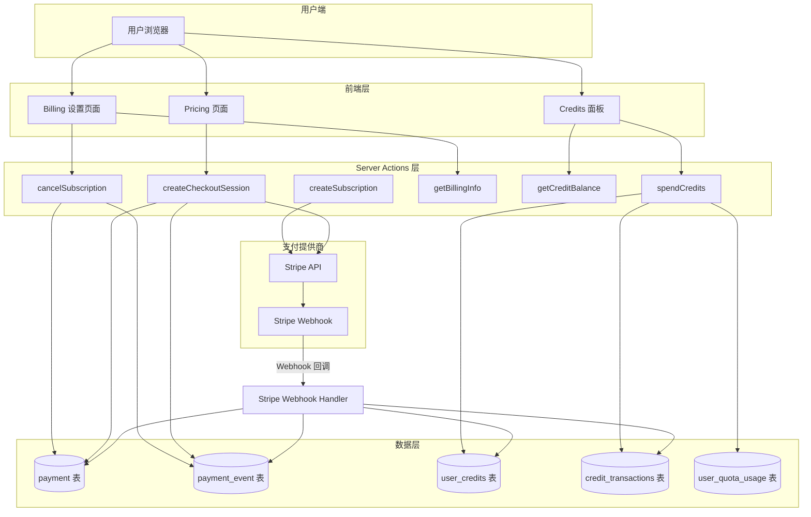

### 1.2 技术栈

| 组件 | 技术 |
|------|------|
| 支付提供商 | Stripe（`stripe` SDK） |
| 数据库 | PostgreSQL（Neon Serverless） |
| ORM | Drizzle ORM |
| 前端框架 | Next.js（App Router） |
| 服务端操作 | Next.js Server Actions |
| Webhook | Next.js API Route |

### 1.3 核心文件清单

| 模块 | 文件路径 | 职责 |
|------|----------|------|
| 支付提供商 | `src/payment/stripe/provider.ts` | Stripe API 封装 |
| Stripe 客户端 | `src/payment/stripe/client.ts` | Stripe 实例初始化 |
| 支付类型 | `src/payment/types.ts` | 支付相关类型定义 |
| 支付配置 | `src/config/payment.config.ts` | 套餐与价格配置 |
| Webhook 处理 | `src/app/api/webhooks/stripe/route.ts` | Stripe Webhook 入口 |
| 支付仓储 | `src/server/db/repositories/payment-repository.ts` | 支付数据 CRUD |
| 积分服务 | `src/lib/credits/credit-service.ts` | 积分核心业务逻辑 |
| 积分配置 | `src/config/credits.config.ts` | 积分消耗规则配置 |
| 配额服务 | `src/lib/quota/quota-service.ts` | 用量配额管理 |
| 数据库 Schema | `src/server/db/schema.ts` | 数据表定义 |
| Server Actions | `src/server/actions/payment/` | 支付相关服务端操作 |
| Server Actions | `src/server/actions/credit-actions.ts` | 积分相关服务端操作 |

---

## 2. 支付模块分析

### 2.1 支付提供商架构（Provider Pattern）

项目采用**提供商模式（Provider Pattern）**对支付接口进行抽象：

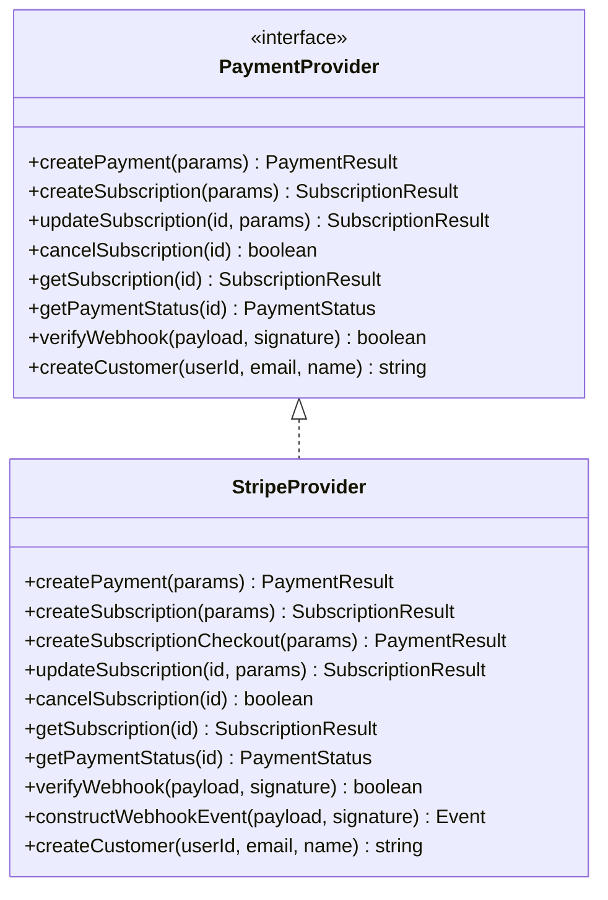

当前仅实现了 `StripeProvider`，但接口设计支持未来接入其他支付提供商（如 LemonSqueezy、Paddle 等）。

### 2.2 支付模式

项目支持两种支付模式：

| 模式 | 类型 | 说明 |
|------|------|------|
| **订阅支付** | `subscription` | 按月/按年周期性扣费 |
| **一次性支付** | `one_time` | 单次付款 |

### 2.3 支付状态流转

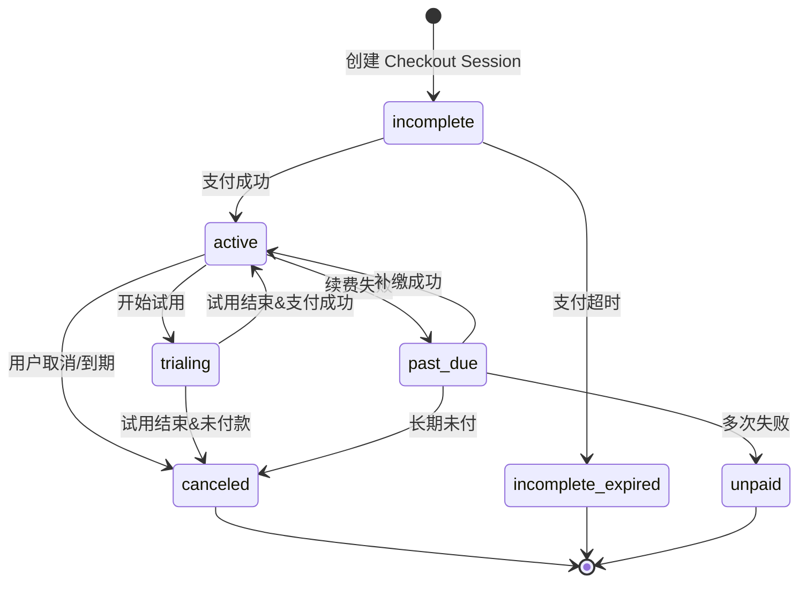

### 2.4 套餐配置

项目定义了三级套餐体系：

| 套餐 | 月价 | 年价 | 月积分 | 年积分 | 订阅即得积分 |
|------|------|------|--------|--------|------------|
| **Free** | $0 | - | 50 | - | 注册送 50 |
| **Pro** | $49 | $499 | 1,000 | 12,000 | 1,000 |
| **Enterprise** | $199 | $1,999 | 5,000 | 60,000 | 5,000 |

### 2.5 支付创建流程

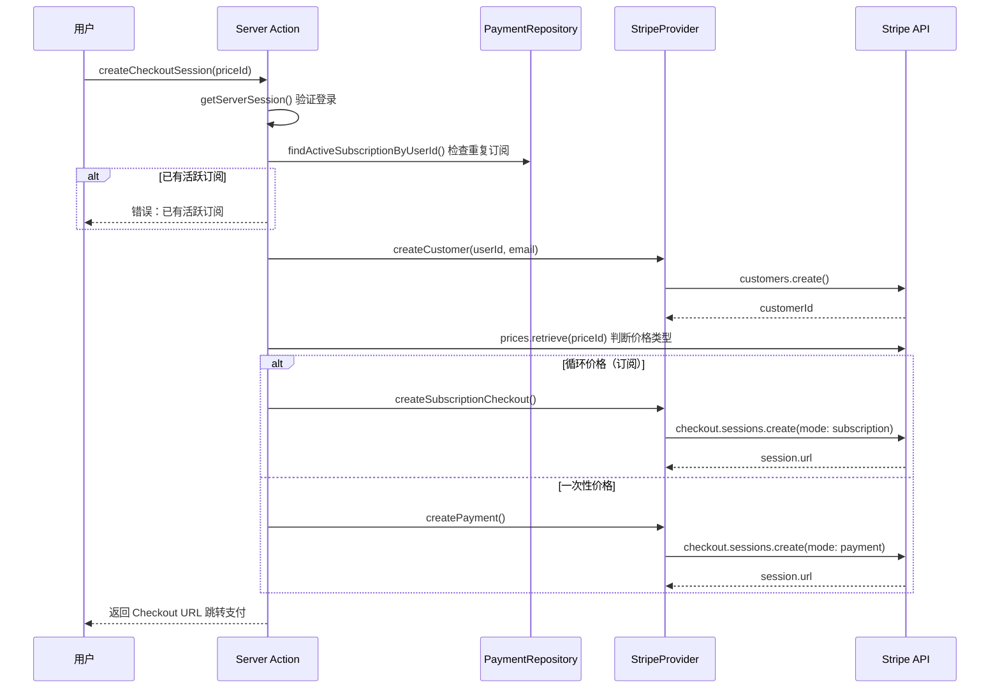

### 2.6 Webhook 事件处理

Stripe Webhook Handler（`/api/webhooks/stripe`）处理以下事件：

| 事件类型 | 处理逻辑 |
|----------|----------|
| `checkout.session.completed` | 创建支付记录、发放订阅积分 |
| `customer.subscription.created` | 更新订阅状态和周期信息 |
| `customer.subscription.updated` | 检测套餐升级、更新状态 |
| `customer.subscription.deleted` | 标记订阅为已取消 |
| `invoice.payment_succeeded` | 记录发票支付成功事件 |
| `invoice.payment_failed` | 记录发票支付失败事件 |
| `invoice.paid` | 发放月度续费积分（跳过首次付款） |

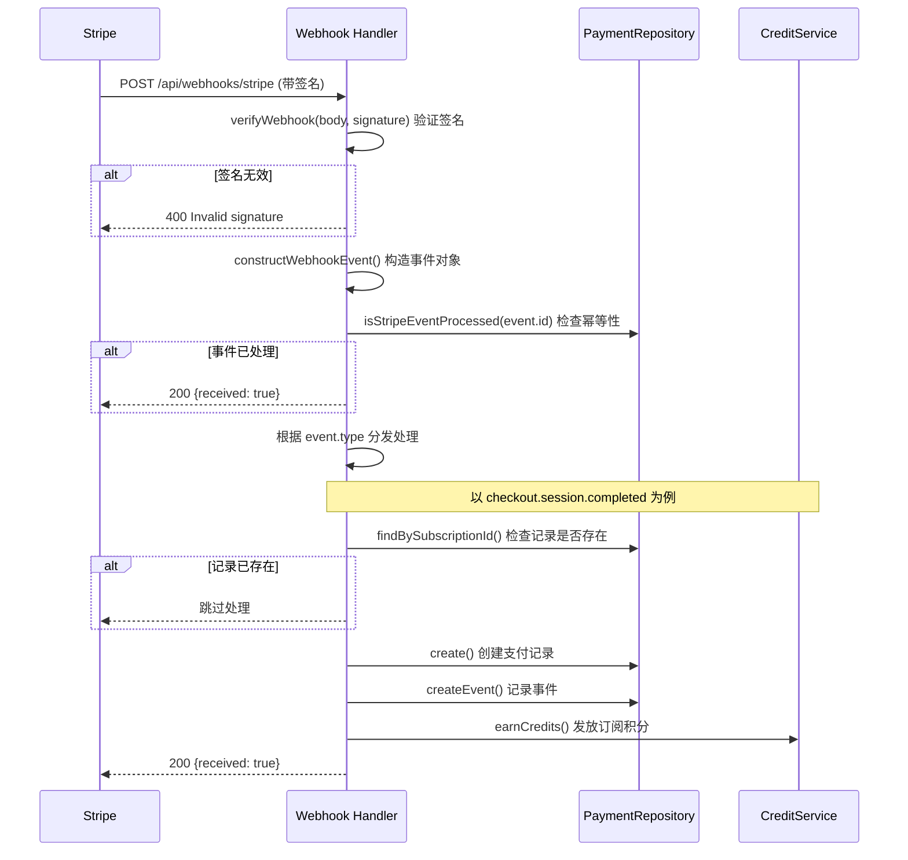

---

## 3. 订单模块分析

### 3.1 数据库 Schema

项目中"订单"概念由 `payment` 和 `payment_event` 两张表共同承载：

#### payment 表（支付/订单主表）

| 字段 | 类型 | 说明 |
|------|------|------|
| `id` | text PK | 支付记录 ID（订阅 ID 或 PaymentIntent ID） |
| `price_id` | text | Stripe Price ID |
| `type` | text | 支付类型：`subscription` / `one_time` |
| `interval` | text | 计费周期：`month` / `year` / `null` |
| `user_id` | text FK | 关联用户 |
| `customer_id` | text | Stripe Customer ID |
| `subscription_id` | text | Stripe 订阅 ID |
| `status` | text | 订阅状态 |
| `period_start` | timestamp | 当前计费周期开始时间 |
| `period_end` | timestamp | 当前计费周期结束时间 |
| `cancel_at_period_end` | boolean | 是否在周期结束后取消 |
| `trial_start` | timestamp | 试用开始时间 |
| `trial_end` | timestamp | 试用结束时间 |
| `created_at` | timestamp | 创建时间 |
| `updated_at` | timestamp | 更新时间 |

#### payment_event 表（支付事件流水表）

| 字段 | 类型 | 说明 |
|------|------|------|
| `id` | text PK | 事件记录 ID |
| `payment_id` | text FK | 关联支付记录 |
| `event_type` | text | 事件类型 |
| `stripe_event_id` | text UNIQUE | Stripe 事件 ID（用于幂等） |
| `event_data` | text | 事件原始数据（JSON 字符串） |
| `created_at` | timestamp | 事件时间 |

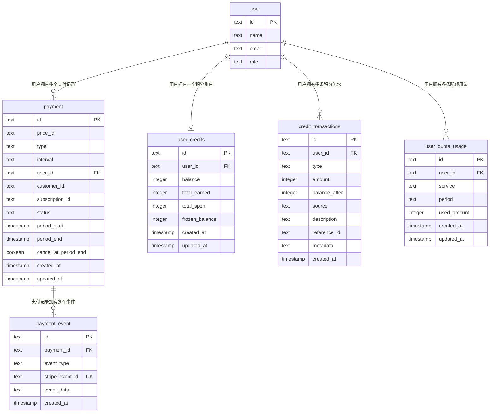

### 3.2 PaymentRepository 核心方法

```
PaymentRepository
├── create(data)                        // 创建支付记录
├── findById(id)                        // 按 ID 查询
├── findByUserId(userId)                // 按用户 ID 查询所有记录
├── findBySubscriptionId(subscriptionId) // 按订阅 ID 查询
├── findByCustomerId(customerId)        // 按客户 ID 查询
├── findActiveSubscriptionByUserId(userId) // 查询用户活跃订阅
├── update(id, data)                    // 更新支付记录
├── delete(id)                          // 删除支付记录
├── createEvent(data)                   // 创建支付事件
└── isStripeEventProcessed(eventId)     // 检查事件是否已处理（幂等检查）
```

### 3.3 订单生命周期

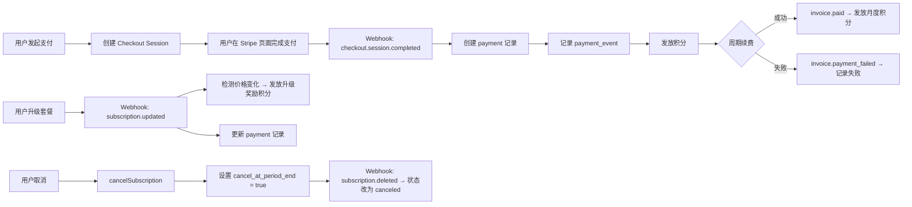

---

## 4. 积分模块分析

### 4.1 积分账户模型

每个用户拥有一个 `user_credits` 账户，包含以下关键字段：

| 字段 | 含义 |
|------|------|
| `balance` | 当前总余额 |
| `totalEarned` | 累计获得积分 |
| `totalSpent` | 累计消耗积分 |
| `frozenBalance` | 冻结积分（不可用于消费） |

**可用余额** = `balance` - `frozenBalance`

### 4.2 积分交易类型

| 类型 | 说明 | 余额影响 |
|------|------|----------|
| `earn` | 获得积分 | balance ↑, totalEarned ↑ |
| `spend` | 消耗积分 | balance ↓, totalSpent ↑ |
| `refund` | 退款返还 | 复用 earn 逻辑 |
| `admin_adjust` | 管理员调整 | 可增可减 |
| `freeze` | 冻结积分 | frozenBalance ↑（balance 不变） |
| `unfreeze` | 解冻积分 | frozenBalance ↓（balance 不变） |

### 4.3 积分来源

| 来源 | 说明 |
|------|------|
| `subscription` | 订阅获得（首次订阅、月度续费、升级奖励） |
| `api_call` | API 调用消耗 |
| `admin` | 管理员手动调整 |
| `storage` | 存储消耗 |
| `bonus` | 注册奖励等活动赠送 |

### 4.4 积分流转全景图

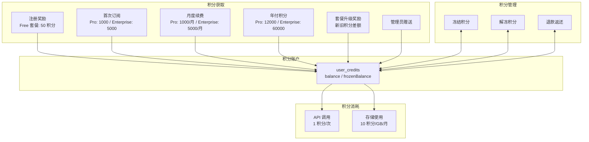

### 4.5 CreditService 核心方法

```
CreditService
├── createCreditAccount(userId)         // 创建积分账户
├── getCreditAccount(userId)            // 获取积分账户
├── getOrCreateCreditAccount(userId)    // 获取或创建账户
├── earnCredits(params)                 // 获得积分（核心方法）
├── spendCredits(params)                // 消耗积分（核心方法）
├── hasEnoughCredits(userId, amount)    // 检查余额是否充足
├── getTransactionHistory(userId, ...)  // 查询交易历史
├── refundCredits(params)               // 退款返还积分
├── adminAdjustCredits(userId, amount)  // 管理员调整
├── freezeCredits(userId, amount)       // 冻结积分
└── unfreezeCredits(userId, amount)     // 解冻积分
```

### 4.6 积分获取流程（earnCredits）

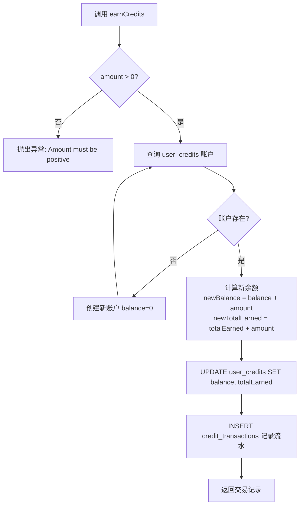

### 4.7 积分消耗流程（spendCredits）

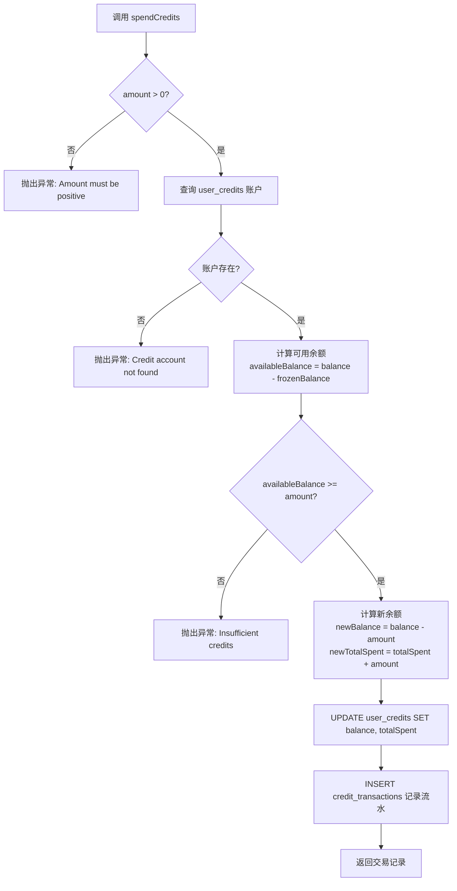

### 4.8 注册奖励积分发放

注册积分的发放通过 `/api/credits/initialize` API 路由实现：

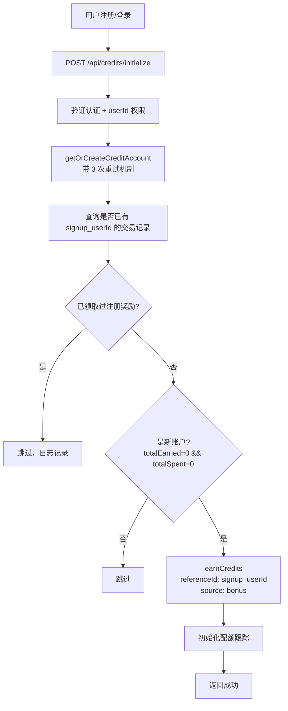

---

## 5. 配额系统

### 5.1 配额模型

配额系统通过 `user_quota_usage` 表按月跟踪用户的资源使用量：

| 服务类型 | 免费用户配额 | Pro 配额 | Enterprise 配额 |
|----------|------------|---------|----------------|
| `api_call` | 100 次/月 | 10,000 次/月 | 100,000 次/月 |
| `storage` | 1 GB | 10 GB | 无限 |

配额系统与积分系统互补：
- **免费用户**：使用配额限制
- **付费用户**：通过积分系统按使用量扣费

### 5.2 配额表的唯一约束

`user_quota_usage` 表通过 `(userId, service, period)` 复合唯一索引确保每个用户每个月每个服务只有一条记录。

---

## 6. 幂等性保证机制

### 6.1 幂等性保障全景

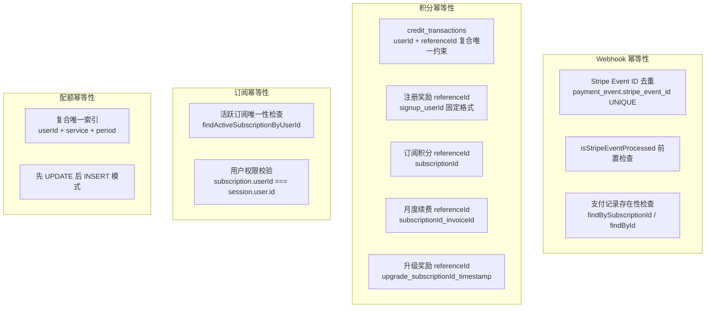

### 6.2 Webhook 事件幂等性

这是整个系统中**最关键**的幂等保障点，因为 Stripe 可能会对同一事件发送多次 Webhook。

#### 6.2.1 第一层：Stripe Event ID 去重

`payment_event` 表中 `stripe_event_id` 字段设置了 **UNIQUE 约束**：

```typescript
// schema.ts
stripeEventId: text('stripe_event_id').unique(),
```

Webhook Handler 在处理每个事件前，先通过 `isStripeEventProcessed()` 方法查询 `payment_event` 表：

```typescript
// route.ts - Webhook 入口
const isProcessed = await paymentRepository.isStripeEventProcessed(event.id);
if (isProcessed) {
    console.log(`[stripe-webhook] Event ${event.id} already processed`);
    return NextResponse.json({ received: true });
}
```

#### 6.2.2 第二层：支付记录存在性检查

在 `handleCheckoutSessionCompleted` 中，创建支付记录前会先查询是否已存在：

```typescript
// 订阅模式
const existingRecord = await paymentRepository.findBySubscriptionId(subscriptionId);
if (existingRecord) {
    console.log(`Payment record already exists for subscription: ${subscriptionId}`);
    return;
}

// 一次性支付模式
const existingRecord = await paymentRepository.findById(paymentIntentId);
if (existingRecord) {
    console.log(`Payment record already exists for payment: ${paymentIntentId}`);
    return;
}
```

#### 6.2.3 幂等性处理时序

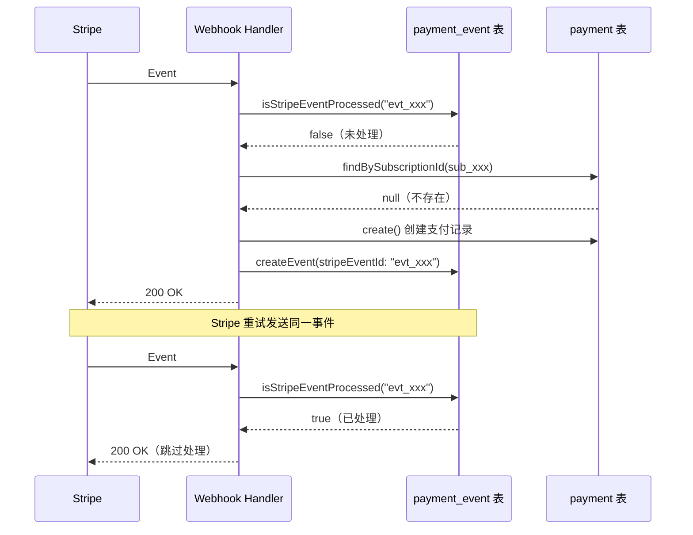

### 6.3 积分发放幂等性

#### 6.3.1 数据库层面：复合唯一约束

`credit_transactions` 表定义了 `(userId, referenceId)` 的复合唯一约束：

```typescript
// schema.ts
(table) => ({
    userReferenceUnique: {
        name: 'credit_user_reference_unique',
        columns: [table.userId, table.referenceId],
        unique: true,
    },
})
```

这意味着：**同一个用户的同一个 `referenceId` 只能有一条积分流水记录**。

#### 6.3.2 各场景的 referenceId 设计

| 场景 | referenceId 格式 | 唯一性保证 |
|------|------------------|-----------|
| 注册奖励 | `signup_{userId}` | 每用户只能领一次 |
| 首次订阅积分 | `{subscriptionId}` | 每个订阅只发一次 |
| 月度续费积分 | `{subscriptionId}_{invoiceId}` | 每张发票只发一次 |
| 升级奖励积分 | `upgrade_{subscriptionId}_{timestamp}` | 时间戳区分不同升级操作 |
| 升级即得积分 | `upgrade_immediate_{subscriptionId}_{timestamp}` | 同上 |
| 管理员赠送 | `admin_{adminUserId}_{timestamp}` | 时间戳区分 |
| 注册奖励（补发脚本） | `signup_bonus_{userId}` / `retroactive_signup_{userId}` | 每用户只能补发一次 |

#### 6.3.3 注册奖励的多重幂等保护

注册奖励积分发放路径 (`/api/credits/initialize`) 有**三层防护**：

1. **业务层**：查询历史交易中是否存在 `referenceId = signup_{userId}` 的记录
2. **业务层**：检查账户是否为新账户（`totalEarned === 0 && totalSpent === 0`）
3. **数据库层**：`(userId, referenceId)` 复合唯一约束，即使前两层检查并发穿透，数据库也会拒绝重复插入

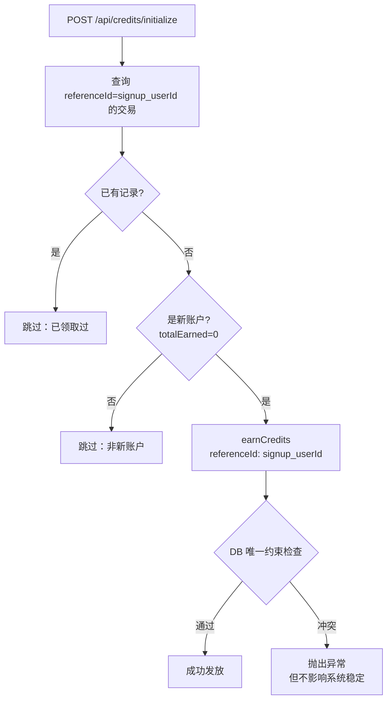

### 6.4 订阅创建幂等性

在 `createCheckoutSession` / `createSubscription` Server Action 中：

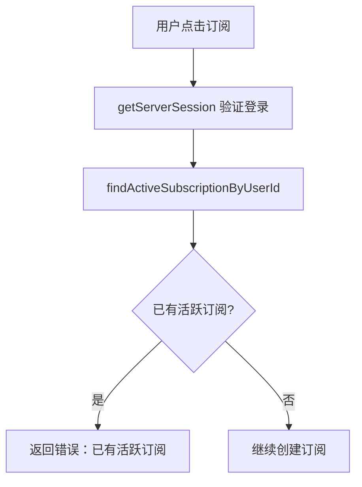

这确保了同一用户不会创建多个活跃订阅。

### 6.5 配额更新幂等性

`user_quota_usage` 表通过 `(userId, service, period)` 复合唯一索引保证每用户每服务每月只有一条记录。`updateQuotaUsage` 方法采用**先 UPDATE 后 INSERT**的模式：

```typescript
// 先尝试更新已有记录
const updated = await db.update(userQuotaUsage)
    .set({ usedAmount: sql`used_amount + ${amount}` })
    .where(/* userId, service, period 匹配 */)
    .returning();

if (updated.length > 0) return updated[0];

// 如果没有已有记录，则插入新记录
const inserted = await db.insert(userQuotaUsage).values(newRecord).returning();
```

### 6.6 幂等性保障总结

| 模块 | 幂等手段 | 层级 |
|------|---------|------|
| Webhook 事件 | `stripe_event_id` UNIQUE + 前置查询 | 数据库 + 应用 |
| 支付记录创建 | `findBySubscriptionId` / `findById` 前置检查 | 应用 |
| 积分发放 | `(userId, referenceId)` 复合唯一约束 | 数据库 |
| 注册奖励 | 三层检查（交易查询 + 新账户判断 + DB 唯一约束） | 应用 + 数据库 |
| 活跃订阅 | `findActiveSubscriptionByUserId` 前置检查 | 应用 |
| 配额更新 | `(userId, service, period)` 复合唯一索引 + 先更新后插入 | 数据库 + 应用 |
| Webhook 签名 | `stripe.webhooks.constructEvent` 签名验证 | 安全 |

---

## 7. 数据流转全景图

### 7.1 从用户注册到积分消耗的完整链路

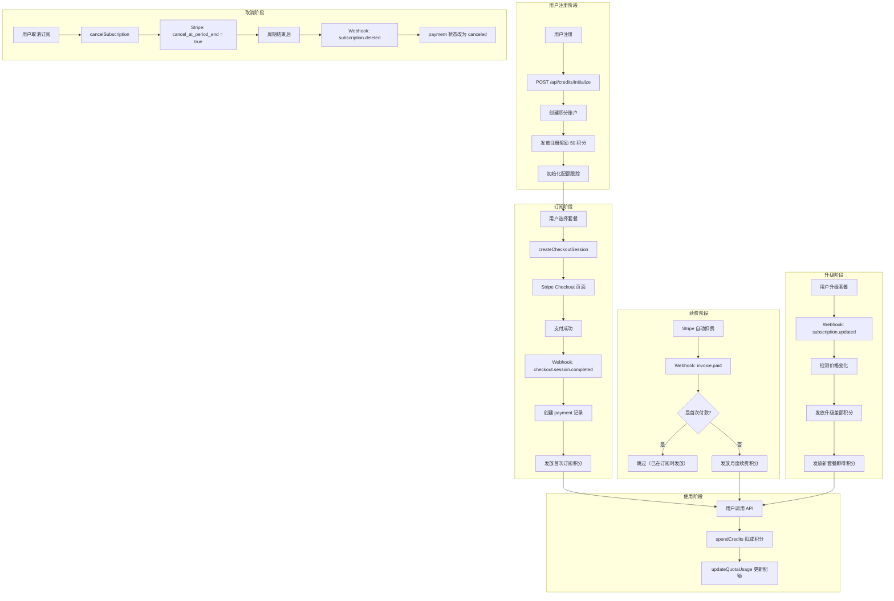

---

## 8. 潜在风险与改进建议

### 8.1 已识别的风险

| 风险点 | 描述 | 严重程度 |
|--------|------|----------|
| **积分操作非原子性** | `earnCredits` / `spendCredits` 中，余额更新和流水插入分为两次独立的 DB 操作，中间如果出错会导致数据不一致 | ⚠️ 高 |
| **并发扣减竞争** | `spendCredits` 中先查后改（read-then-write），高并发下可能出现超扣 | ⚠️ 高 |
| **Stripe Customer ID 未持久化** | `createCheckoutSession` 每次都创建新的 Stripe Customer，`TODO` 注释表明 `stripeCustomerId` 尚未存入用户表 | ⚠️ 中 |
| **升级积分的 referenceId 含 timestamp** | `upgrade_{subscriptionId}_{Date.now()}` 中使用时间戳，理论上在极短时间内重试不会命中唯一约束 | ⚠️ 低 |
| **Webhook 异常未完全捕获** | 部分 handler 的 catch 中 `throw error` 会导致 Stripe 重试，但重试时由于幂等检查会直接返回，这是预期行为 | ℹ️ 低 |

### 8.2 改进建议

#### 8.2.1 引入数据库事务保证积分操作原子性

当前 `earnCredits` / `spendCredits` 中的余额更新和流水插入是两个独立的 SQL 操作。建议将它们包裹在数据库事务中：

```typescript
// 改进方案示例（伪代码）
await db.transaction(async (tx) => {
    await tx.update(userCredits).set({ balance: newBalance, ... });
    await tx.insert(creditTransactions).values({ ... });
});
```

#### 8.2.2 使用乐观锁或悲观锁防止并发超扣

当前的 `spendCredits` 方法存在经典的 TOCTOU（Time-of-check to Time-of-use）问题。建议使用以下方式之一：

- **乐观锁**：在 `user_credits` 表增加 `version` 字段，UPDATE 时带版本条件
- **悲观锁**：使用 `SELECT ... FOR UPDATE` 锁定行
- **原子 SQL**：直接使用 `UPDATE ... SET balance = balance - $amount WHERE balance - frozen_balance >= $amount` 并检查影响行数

#### 8.2.3 持久化 Stripe Customer ID

当前代码中有明确的 `TODO` 注释，应尽快实现将 `stripeCustomerId` 保存到用户表，避免重复创建 Customer。

#### 8.2.4 统一升级积分的 referenceId 生成策略

建议将升级积分的 `referenceId` 改为基于确定性信息（如 `upgrade_{subscriptionId}_{oldPriceId}_{newPriceId}`），避免使用 `Date.now()` 带来的幂等漏洞。

---

> **文档版本**: v1.0
> **生成日期**: 2026-02-06
> **基于代码版本**: 当前主分支
