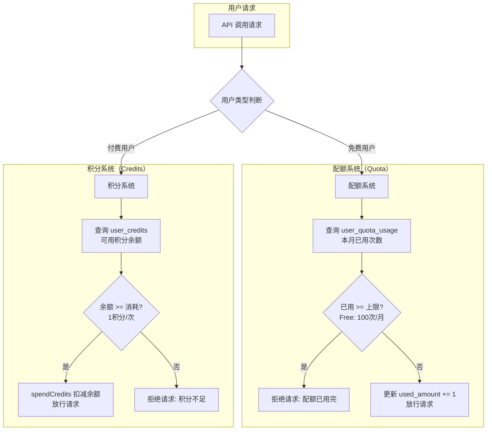
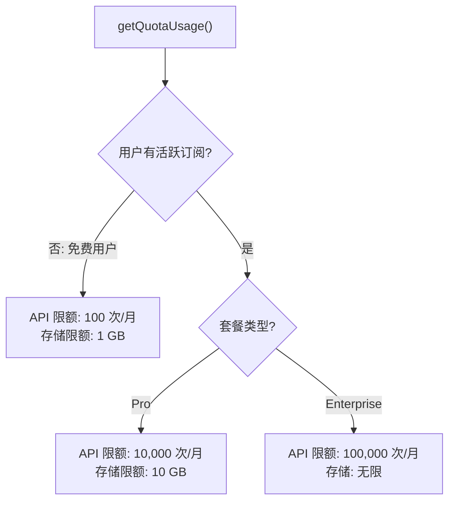
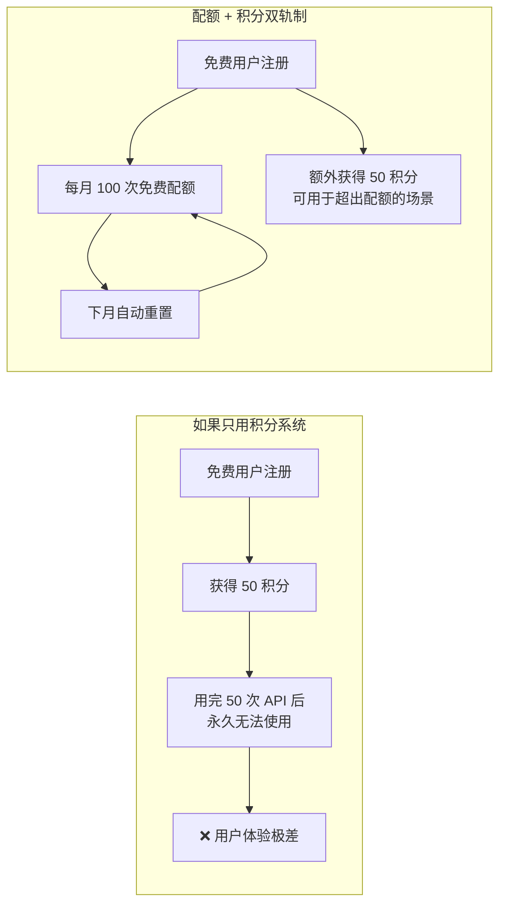
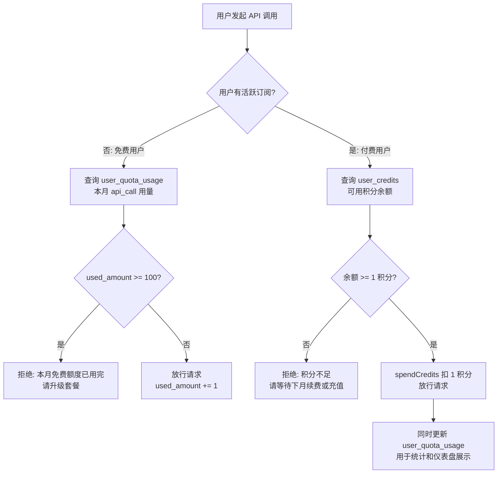
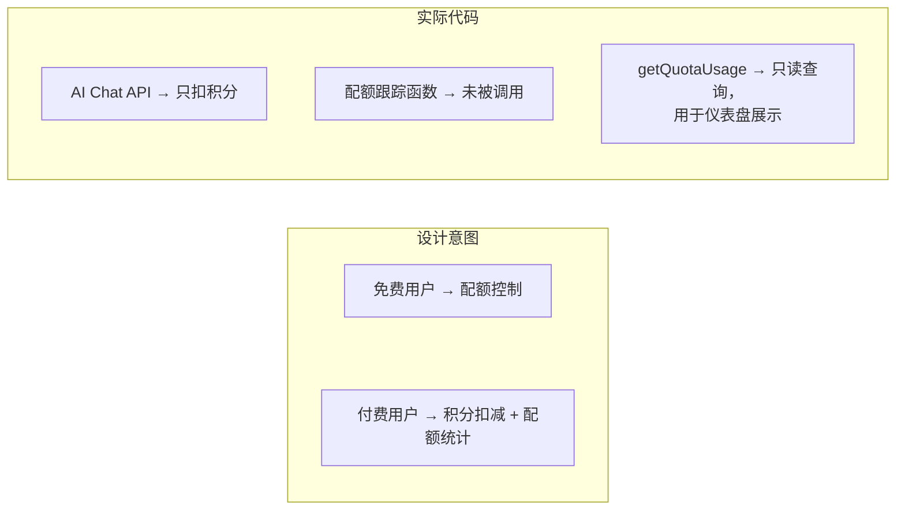
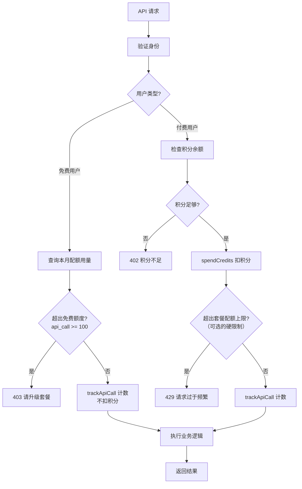

# user_quota_usage 表深度分析：配额系统与积分系统的关系

> 本文档分析 `user_quota_usage` 表的设计意图、它与积分系统的关系，以及为什么 API 调用不直接只扣积分。

---

## 目录

1. [user_quota_usage 表概览](#1-user_quota_usage-表概览)
2. [设计意图：双轨制资源控制](#2-设计意图双轨制资源控制)
3. [配额系统与积分系统的分工](#3-配额系统与积分系统的分工)
4. [为什么不直接扣积分？](#4-为什么不直接扣积分)
5. [当前代码实际调用情况](#5-当前代码实际调用情况)
6. [存在的问题与改进建议](#6-存在的问题与改进建议)

---

## 1. user_quota_usage 表概览

### 1.1 表结构

```sql
CREATE TABLE user_quota_usage (
    id          TEXT PRIMARY KEY,
    user_id     TEXT NOT NULL REFERENCES "user"(id) ON DELETE CASCADE,
    service     TEXT NOT NULL,           -- 'api_call' | 'storage' | 'custom'
    period      TEXT NOT NULL,           -- 格式: 'YYYY-MM'
    used_amount INTEGER NOT NULL DEFAULT 0,
    created_at  TIMESTAMP NOT NULL,
    updated_at  TIMESTAMP NOT NULL,

    -- 复合唯一索引：每用户每服务每月只有一条记录
    UNIQUE (user_id, service, period)
);
```

### 1.2 核心特征

| 特征 | 说明 |
|------|------|
| **按月周期** | `period` 字段以 `YYYY-MM` 格式记录，天然支持按月重置 |
| **按服务分类** | 支持 `api_call`、`storage`、`custom` 三种服务类型 |
| **累加计数** | `used_amount` 只增不减（在同一周期内），记录的是**使用量**而非余额 |
| **唯一约束** | `(user_id, service, period)` 复合唯一索引，确保每用户每服务每月只有一条记录 |

### 1.3 与积分表的本质区别

| 维度 | user_quota_usage（配额表） | user_credits + credit_transactions（积分表） |
|------|--------------------------|----------------------------------------------|
| **记录内容** | 使用量（累加计数器） | 余额（可增可减的账户） |
| **时间维度** | 按月分片（YYYY-MM） | 无时间分片，全局余额 |
| **重置机制** | 每月自动/手动重置为 0 | 不重置，只通过 earn/spend 变化 |
| **目标用户** | 主要面向免费用户 | 主要面向付费用户 |
| **控制方式** | 硬性上限（到达限额即禁止） | 余额扣减（余额不足即禁止） |

---

## 2. 设计意图：双轨制资源控制

项目采用了**双轨制**的资源控制策略——**配额（Quota）** 和 **积分（Credits）** 并行存在，分别服务于不同的用户群体。



### 2.1 配额（Quota）——面向免费用户

配额是一种**硬性上限**控制机制，配置定义在 `credits.config.ts` 中：

```typescript
// 免费用户配额
freeUser: {
    apiCall: {
        freeQuotaCalls: 100,  // 每月 100 次 API 调用
    },
    storage: {
        freeQuotaGB: 1,       // 1 GB 免费存储
    },
},
```

特点：
- 不涉及任何"货币"概念
- 每月有固定的免费使用次数
- 达到上限后必须升级为付费用户才能继续使用
- 用量记录在 `user_quota_usage` 表中

### 2.2 积分（Credits）——面向付费用户

积分是一种**虚拟货币**机制，配置同样在 `credits.config.ts` 中：

```typescript
// 付费用户积分消耗规则
consumption: {
    apiCall: {
        costPerCall: 1,       // 每次 API 调用消耗 1 积分
        freeQuotaCalls: 0,    // 付费用户无免费配额，全部走积分
    },
    storage: {
        costPerGBPerMonth: 10, // 每 GB 每月消耗 10 积分
        freeQuotaGB: 0,       // 付费用户无免费配额
    },
},
```

特点：
- 通过订阅获得积分（如 Pro 每月 1,000 积分）
- 每次使用从积分余额扣减
- 积分用完可等待下月续费，或升级更高套餐
- 流水记录在 `credit_transactions` 表中

---

## 3. 配额系统与积分系统的分工

### 3.1 按套餐分层的资源限额

`getQuotaUsage` Server Action 中体现了这种分层逻辑：



### 3.2 两套系统的数据来源对比

| 套餐 | 月 API 调用上限 | 月存储上限 | 月积分 | 每次 API 积分消耗 |
|------|----------------|-----------|--------|------------------|
| **Free** | 100 次 | 1 GB | 50（注册赠送） | 1 |
| **Pro** | 10,000 次 | 10 GB | 1,000 | 1 |
| **Enterprise** | 100,000 次 | 无限 | 5,000 | 1 |

可以看到：
- **配额上限**和**积分额度**是**独立的两套数值体系**
- Pro 用户拿到 1,000 积分，但配额上限是 10,000 次——这意味着积分可能先耗尽，但配额计数仍未到上限

---

## 4. 为什么不直接扣积分？

### 4.1 核心原因：免费用户没有（或几乎没有）积分

免费用户仅在注册时获得 50 积分。如果纯靠积分控制，只需 50 次 API 调用后就彻底无法使用了。但项目期望免费用户每月有 100 次的使用额度——这个额度需要**每月重置**，而积分系统不具备自动重置机制。



### 4.2 配额系统存在的六个理由

| 理由 | 说明 |
|------|------|
| **1. 免费试用体验** | 允许免费用户每月持续试用产品，而不是注册积分耗尽后就彻底无法体验 |
| **2. 用量可预测性** | 配额是确定性的上限，企业客户的 IT 管理员可以精确规划 API 调用预算 |
| **3. 按月自动重置** | 配额按 `YYYY-MM` 周期自然轮转，无需手动发放积分 |
| **4. 成本控制** | 即使付费用户有大量积分，配额仍可作为安全阀防止异常调用（如死循环、脚本失控） |
| **5. 监控与统计** | 配额表天然提供了按月、按服务的使用量统计数据，便于用户查看用量仪表盘 |
| **6. 计费模型灵活性** | 积分负责"钱"的维度，配额负责"量"的维度，两者解耦使得未来可独立调整 |

### 4.3 双轨制决策流程（完整版）



---

## 5. 当前代码实际调用情况

### 5.1 实际的 API 调用路由

项目中唯一的实际 API 消费端点是 `src/app/api/v1/ai/chat/route.ts`（AI 聊天 API）：

```
请求 → 验证 API Key → 检查积分余额 → spendCredits 扣减积分 → 调用 AI 服务 → 返回结果
```

**关键发现**：该路由 **只调用了 `spendCredits`，没有调用 `trackApiCall` 或 `updateQuotaUsage`**。

### 5.2 配额跟踪函数的调用方

通过全局搜索，`trackApiCall` 和 `trackStorageUsage` **在业务代码中没有被任何路由实际调用**。它们仅在以下位置被定义和导出：

| 函数 | 定义位置 | 是否被业务代码调用 |
|------|---------|------------------|
| `quotaService.trackApiCall` | `src/lib/quota/quota-service.ts` | ❌ 无 |
| `quotaService.trackStorageUsage` | `src/lib/quota/quota-service.ts` | ❌ 无 |
| `updateUserQuotaUsage` | `src/server/actions/credit-actions.ts` | ❌ 无（仅暴露为 Server Action） |
| `quotaService.initializeForUser` | `src/lib/quota/quota-service.ts` | ✅ 仅在用户注册初始化时调用 |

### 5.3 现状总结



当前实际状态：
- ✅ **积分系统**已完整实现并在 AI Chat API 中使用
- ⚠️ **配额系统**的写入函数（`trackApiCall` 等）已实现但未被业务代码调用
- ✅ **配额查询**（`getQuotaUsage`）已实现，用于前端仪表盘展示用量和限额
- ⚠️ **配额检查**（判断用量是否超限）的逻辑**尚未在 API 路由中实现**

---

## 6. 存在的问题与改进建议

### 6.1 问题一：配额写入未接入业务

`trackApiCall` 等函数已实现但未在 API 路由中调用，导致 `user_quota_usage` 表中的 `api_call` 用量永远为 0。前端仪表盘展示的 API 调用数将与实际不符。

**建议**：在 AI Chat API 路由中扣减积分后，同步调用 `quotaService.trackApiCall`：

```typescript
// src/app/api/v1/ai/chat/route.ts 中，扣积分后增加：
await quotaService.trackApiCall(validApiKey.userId);
```

### 6.2 问题二：免费用户未做配额检查

当前 AI Chat API 只检查积分余额，对免费用户（注册赠送 50 积分）而言，50 积分用完即无法使用。但配置中定义免费用户有 100 次/月的免费配额。这两个数值存在矛盾。

**建议**：在 API 路由中加入配额优先判断逻辑：

```typescript
// 伪代码
if (isFreeUser) {
    const usage = await quotaService.getApiCallUsage(userId);
    if (usage.usedAmount >= creditsConfig.freeUser.apiCall.freeQuotaCalls) {
        return 403; // 免费额度已用完
    }
    await quotaService.trackApiCall(userId); // 只计数，不扣积分
} else {
    await creditService.spendCredits(...);   // 扣积分
    await quotaService.trackApiCall(userId); // 同时记录用量
}
```

### 6.3 问题三：付费用户配额上限未强制执行

配置中 Pro 用户有 10,000 次/月的上限，Enterprise 有 100,000 次/月，但代码中只检查积分余额，未检查配额上限。理论上如果 Pro 用户通过管理员赠送获得大量积分，可以超出 10,000 次的限制。

**建议**：视业务需求决定——如果配额上限仅用于展示（软限制），保持现状即可；如果需要硬限制，需在 API 路由中增加配额检查。

### 6.4 总结：推荐的完整调用流程



---

> **结论**：`user_quota_usage` 表的存在是合理的——它与积分系统构成**双轨制资源控制**，分别服务免费用户（配额上限）和付费用户（积分扣减），同时为所有用户提供用量统计数据。但当前代码中配额的写入和检查逻辑尚未完整接入业务路由，需要补全。
