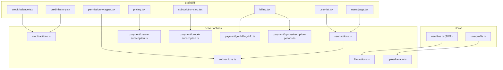
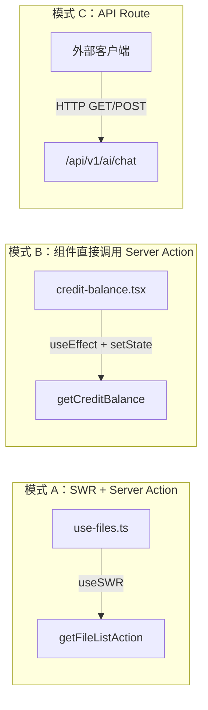
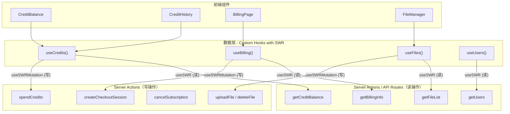

# SWR 与 Server Actions 架构分析

> 分析项目中 SWR 的作用、`server/actions` 目录下各 action 的职责与使用情况，以及是否为最佳方案。

---

## 目录

1. [SWR 在项目中的作用](#1-swr-在项目中的作用)
2. [Server Actions 清单与职责](#2-server-actions-清单与职责)
3. [使用情况审计](#3-使用情况审计)
4. [Server Actions 是最佳方案吗？](#4-server-actions-是最佳方案吗)
5. [改进建议](#5-改进建议)

---

## 1. SWR 在项目中的作用

### 1.1 什么是 SWR

SWR（stale-while-revalidate）是 Vercel 出品的 React 数据请求库，核心策略是：**先返回缓存数据（stale），同时发起请求获取最新数据（revalidate）**。

### 1.2 项目中的使用情况

SWR **仅在一个文件中使用**：

| 文件 | 用途 |
|------|------|
| `src/hooks/use-files.ts` | 文件管理模块的数据获取与变更 |

具体用法：

```
useSWR          → 获取文件列表（带分页、搜索），自动缓存和去重
useSWRMutation  → 上传文件、删除文件（乐观更新 + 失败回滚）
```

### 1.3 SWR 在该场景下的价值

| 特性 | 在 `use-files.ts` 中的体现 |
|------|---------------------------|
| **缓存去重** | `dedupingInterval: 5000`，5 秒内重复请求自动去重 |
| **自动重新验证** | 网络重连时自动刷新文件列表 |
| **乐观更新** | 删除文件时先从本地列表移除，失败后回滚 |
| **变更后刷新** | 上传/删除成功后自动调用 `mutate()` 刷新列表 |

### 1.4 SWR 使用范围评估

项目中 SWR 的使用非常有限（仅 1 个 hook），其他数据获取场景均直接在组件中调用 Server Actions：

```
credit-balance.tsx   → 直接调用 getCreditBalance()
credit-history.tsx   → 直接调用 getCreditHistory()
user-list.tsx        → 直接调用 getUsers()
billing.tsx          → 直接调用 getBillingInfo()
```

这导致这些组件**缺失**了 SWR 提供的缓存、去重、自动重新验证等能力。

---

## 2. Server Actions 清单与职责

### 2.1 文件总览

项目 `src/server/actions/` 下共有 **10 个文件**，分为 4 组：

#### 认证与权限

| 文件 | 导出函数 | 职责 |
|------|---------|------|
| `auth-actions.ts` | `getUserAdminStatus()` | 检查当前用户是否为管理员 |

#### 积分相关

| 文件 | 导出函数 | 职责 |
|------|---------|------|
| `credit-actions.ts` | `getCreditBalance()` | 获取用户积分余额 |
| | `getCreditHistory()` | 获取积分交易历史 |
| | `grantCreditsToUser()` | 管理员给用户发放积分 |
| | `spendCredits()` | 为服务消费积分 |

#### 文件管理

| 文件 | 导出函数 | 职责 |
|------|---------|------|
| `file-actions.ts` | `uploadFileAction()` | 上传文件 |
| | `deleteFileAction()` | 删除文件 |
| | `getFileListAction()` | 获取文件列表（分页+搜索） |
| | `getFileInfoAction()` | 获取单个文件信息 |
| `upload-avatar.ts` | `uploadAvatarAction()` | 上传用户头像（带类型和大小校验） |
| `error-messages.ts` | `getErrorMessage()` | 多语言错误信息辅助函数（非 action） |

#### 支付相关

| 文件 | 导出函数 | 职责 |
|------|---------|------|
| `payment/create-subscription.ts` | `createCheckoutSession()` | 创建 Stripe 结账会话 |
| `payment/cancel-subscription.ts` | `cancelSubscription()` | 取消订阅 |
| `payment/get-billing-info.ts` | `getBillingInfo()` | 获取账单和订阅信息 |
| `payment/sync-subscription-periods.ts` | `syncSubscriptionPeriods()` | 批量同步订阅周期 |
| | `syncSingleSubscription()` | 同步单个订阅周期 |

#### 用户管理

| 文件 | 导出函数 | 职责 |
|------|---------|------|
| `user-actions.ts` | `getUserStats()` | 获取用户统计（管理员） |
| | `getUsers()` | 分页获取用户列表（管理员） |

---

## 3. 使用情况审计

### 3.1 调用关系图



### 3.2 使用状态汇总

| 函数 | 被调用位置 | 状态 |
|------|-----------|------|
| `getUserAdminStatus()` | `user-actions.ts`, `permission-wrapper.tsx` | ✅ 使用中 |
| `getCreditBalance()` | `credit-balance.tsx` | ✅ 使用中 |
| `getCreditHistory()` | `credit-history.tsx` | ✅ 使用中 |
| **`grantCreditsToUser()`** | 无外部调用 | ⚠️ **未使用** |
| **`spendCredits()`**（action 版） | 无外部调用 | ⚠️ **未使用** |
| `uploadFileAction()` | `use-files.ts` | ✅ 使用中 |
| `deleteFileAction()` | `use-files.ts` | ✅ 使用中 |
| `getFileListAction()` | `use-files.ts` | ✅ 使用中 |
| **`getFileInfoAction()`** | 无外部调用 | ⚠️ **未使用** |
| `uploadAvatarAction()` | `use-profile.ts` | ✅ 使用中 |
| `getErrorMessage()` | `file-actions.ts`, `upload-avatar.ts` | ✅ 使用中（内部辅助） |
| `createCheckoutSession()` | `pricing.tsx` | ✅ 使用中 |
| `cancelSubscription()` | `subscription-card.tsx` | ✅ 使用中 |
| `getBillingInfo()` | `billing.tsx` | ✅ 使用中 |
| **`syncSubscriptionPeriods()`** | 无外部调用 | ⚠️ **未使用** |
| `syncSingleSubscription()` | `billing.tsx` | ✅ 使用中 |
| `getUserStats()` | `users/page.tsx` | ✅ 使用中 |
| `getUsers()` | `user-list.tsx` | ✅ 使用中 |

### 3.3 未使用的 Actions

共 **4 个函数**未被任何外部代码调用：

1. **`grantCreditsToUser()`** — 管理员发放积分，可能为预留功能
2. **`spendCredits()`**（action 版本） — 服务消费积分。实际 API 调用扣积分是在 `api/v1/ai/chat/route.ts` 中直接调用 `creditService.spendCredits()`，没有通过这个 action
3. **`getFileInfoAction()`** — 获取单文件信息，定义了但无调用方
4. **`syncSubscriptionPeriods()`** — 批量同步订阅周期，只有单条同步版本 `syncSingleSubscription()` 在使用

---

## 4. Server Actions 是最佳方案吗？

### 4.1 Next.js Server Actions 的优势

| 优势 | 体现 |
|------|------|
| **零 API 路由配置** | 函数加 `'use server'` 即可从客户端调用 |
| **类型安全** | 输入输出类型自动在客户端-服务端之间传递 |
| **内置安全** | 自动处理 CSRF 保护 |
| **简化代码** | 无需手动 `fetch`、处理 URL、序列化/反序列化 |

### 4.2 当前实现的问题

#### 问题 1：数据获取场景使用 Server Actions 不够理想

Server Actions 设计初衷是**数据变更**（mutations），不是数据获取（queries）。当前项目中大量 **读操作** 使用 Server Actions：

```
getCreditBalance()    → 读操作
getCreditHistory()    → 读操作
getQuotaUsage()       → 读操作（已删除）
getBillingInfo()      → 读操作
getUserStats()        → 读操作
getUsers()            → 读操作
getFileListAction()   → 读操作
```

**问题**：
- Server Actions 请求使用 **POST** 方法，无法利用 HTTP 缓存（GET 缓存）
- 每次组件挂载都重新请求，没有缓存去重
- 无法利用 Next.js 的 `fetch` 缓存和 ISR（Incremental Static Regeneration）机制

#### 问题 2：数据获取模式不一致

项目中存在 **三种不同的数据获取模式**，缺乏统一规范：



| 模式 | 缓存 | 去重 | 乐观更新 | 使用位置 |
|------|------|------|---------|---------|
| A: SWR + Action | ✅ | ✅ | ✅ | 仅文件管理 |
| B: 直接调用 Action | ❌ | ❌ | ❌ | 积分、账单、用户管理 |
| C: API Route | ❌ | ❌ | ❌ | AI Chat、Webhook、Blog API |

#### 问题 3：读写职责混在同一文件

`credit-actions.ts` 同时包含读操作（`getCreditBalance`）和写操作（`spendCredits`），职责不清晰。

#### 问题 4：SWR 利用率极低

项目安装了 SWR 依赖，但仅在 `use-files.ts` 一个文件中使用，其他同类场景没有利用 SWR 的缓存和去重能力。

---

## 5. 改进建议

### 5.1 推荐架构：统一数据获取层



### 5.2 具体改进步骤

#### 第一步：统一 Hook 层（参照 use-files.ts 模式）

为每个业务模块创建 SWR hook，统一数据获取和缓存策略：

| 新增 Hook | 对应 Actions | 说明 |
|-----------|-------------|------|
| `use-credits.ts` | `getCreditBalance`, `getCreditHistory` | 积分数据 |
| `use-billing.ts` | `getBillingInfo`, `syncSingleSubscription` | 账单数据 |
| `use-users.ts` | `getUserStats`, `getUsers` | 用户管理数据 |

每个 hook 统一使用 `useSWR` 做读取、`useSWRMutation` 做变更，和现有 `use-files.ts` 保持一致。

#### 第二步：	

| 函数 | 建议 |
|------|------|
| `grantCreditsToUser()` | 保留但标注为"管理后台预留"，或在管理后台实际使用 |
| `spendCredits()` (action 版) | 考虑删除，API 调用场景直接用 `creditService` |
| `getFileInfoAction()` | 暂时保留，可能在文件详情页使用 |
| `syncSubscriptionPeriods()` | 如无批量场景可删除，保留 `syncSingleSubscription` 即可 |

#### 第三步：明确 Server Actions vs API Routes 的分工

| 场景 | 推荐方案 | 原因 |
|------|---------|------|
| **前端组件读数据** | Server Action + SWR Hook | 类型安全，无需手动 fetch |
| **前端组件写数据** | Server Action + useSWRMutation | 支持乐观更新和缓存刷新 |
| **外部 API 调用** | API Route（`/api/v1/*`） | 需要 HTTP 标准接口 |
| **Webhook 接收** | API Route（`/api/webhooks/*`） | 外部服务回调 |
| **Cron 任务** | API Route（`/api/cron/*`） | 定时触发 |

#### 第四步（可选）：考虑 React Query 替代 SWR

如果项目复杂度增长，React Query（TanStack Query）提供了更强大的功能：

| 特性 | SWR | React Query |
|------|-----|-------------|
| 缓存管理 | 简单 | 更精细 |
| 离线支持 | 基本 | 完善 |
| DevTools | 无 | 有 |
| 分页/无限滚动 | 基本 | 原生支持 |
| 乐观更新 | 手动 | 内置 API |
| 体积 | 更小（~4KB） | 稍大（~13KB） |

对于当前项目规模，**SWR 完全够用**，无需切换。

---

## 总结

| 维度 | 现状 | 建议 |
|------|------|------|
| **SWR** | 仅在 `use-files.ts` 中使用，利用率极低 | 推广到所有数据获取场景，统一 Hook 层 |
| **Server Actions** | 读写混用，无缓存 | 保留作为数据层，配合 SWR Hook 使用 |
| **未使用的 Actions** | 4 个函数无外部调用 | 清理或明确标注为预留功能 |
| **数据获取模式** | 3 种模式混用，不一致 | 统一为 SWR + Server Action 模式 |
| **API Routes** | 正确用于外部 API、Webhook、Cron | 保持不变 |

**核心结论**：Server Actions 本身没有问题，问题在于缺乏统一的数据获取层。参照已有的 `use-files.ts` 模式，为其他模块也建立 SWR hook，即可解决缓存、去重、一致性问题。
